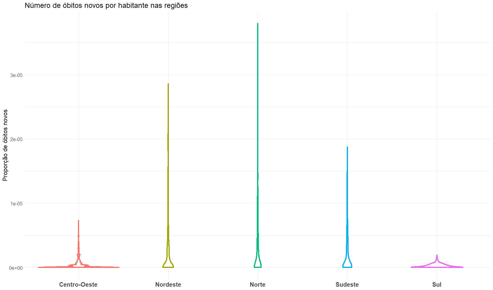

Análise Coronavírus Brasil (dados até o dia 15/06/2020)
================

## Dados disponíveis em: <https://covid.saude.gov.br/>

### Estrutura

``` r
str(corona.brasil)
```

    ## tibble [389,992 x 16] (S3: tbl_df/tbl/data.frame)
    ##  $ regiao               : chr [1:389992] "Brasil" "Brasil" "Brasil" "Brasil" ...
    ##  $ estado               : chr [1:389992] NA NA NA NA ...
    ##  $ municipio            : chr [1:389992] NA NA NA NA ...
    ##  $ coduf                : chr [1:389992] "76" "76" "76" "76" ...
    ##  $ codmun               : num [1:389992] NA NA NA NA NA NA NA NA NA NA ...
    ##  $ codRegiaoSaude       : num [1:389992] NA NA NA NA NA NA NA NA NA NA ...
    ##  $ nomeRegiaoSaude      : chr [1:389992] NA NA NA NA ...
    ##  $ data                 : POSIXct[1:389992], format: "2020-02-25" "2020-02-26" ...
    ##  $ semanaEpi            : num [1:389992] 9 9 9 9 9 10 10 10 10 10 ...
    ##  $ populacaoTCU2019     : chr [1:389992] "210147125" "210147125" "210147125" "210147125" ...
    ##  $ casosAcumulado       : num [1:389992] 0 1 1 1 2 2 2 2 3 7 ...
    ##  $ casosNovos           : num [1:389992] 0 1 0 0 1 0 0 0 1 4 ...
    ##  $ obitosAcumulado      : num [1:389992] 0 0 0 0 0 0 0 0 0 0 ...
    ##  $ obitosNovos          : num [1:389992] 0 0 0 0 0 0 0 0 0 0 ...
    ##  $ Recuperadosnovos     : num [1:389992] NA NA NA NA NA NA NA NA NA NA ...
    ##  $ emAcompanhamentoNovos: num [1:389992] NA NA NA NA NA NA NA NA NA NA ...

``` r
knitr::kable(tail(corona.brasil), align = 'c')
```

|    regiao    | estado | municipio | coduf | codmun | codRegiaoSaude | nomeRegiaoSaude  |    data    | semanaEpi | populacaoTCU2019 | casosAcumulado | casosNovos | obitosAcumulado | obitosNovos | Recuperadosnovos | emAcompanhamentoNovos |
| :----------: | :----: | :-------: | :---: | :----: | :------------: | :--------------: | :--------: | :-------: | :--------------: | :------------: | :--------: | :-------------: | :---------: | :--------------: | :-------------------: |
| Centro-Oeste |   DF   | Brasília  |  53   | 530010 |     53001      | DISTRITO FEDERAL | 2020-06-10 |    24     |     3015268      |     19433      |    1343    |       256       |     20      |        NA        |          NA           |
| Centro-Oeste |   DF   | Brasília  |  53   | 530010 |     53001      | DISTRITO FEDERAL | 2020-06-11 |    24     |     3015268      |     20507      |    1074    |       274       |     18      |        NA        |          NA           |
| Centro-Oeste |   DF   | Brasília  |  53   | 530010 |     53001      | DISTRITO FEDERAL | 2020-06-12 |    24     |     3015268      |     21396      |    889     |       282       |      8      |        NA        |          NA           |
| Centro-Oeste |   DF   | Brasília  |  53   | 530010 |     53001      | DISTRITO FEDERAL | 2020-06-13 |    24     |     3015268      |     21959      |    563     |       293       |     11      |        NA        |          NA           |
| Centro-Oeste |   DF   | Brasília  |  53   | 530010 |     53001      | DISTRITO FEDERAL | 2020-06-14 |    25     |     3015268      |     22871      |    912     |       304       |     11      |        NA        |          NA           |
| Centro-Oeste |   DF   | Brasília  |  53   | 530010 |     53001      | DISTRITO FEDERAL | 2020-06-15 |    25     |     3015268      |     23684      |    813     |       319       |     15      |        NA        |          NA           |

### Distribuição do número de novos registros entre os casos de novos óbitos, recuperados e em acompanhamento.

``` r
corona.brasil %>% 
  filter(!is.na(emAcompanhamentoNovos) & !is.na(Recuperadosnovos)) %>% 
  select(data, obitosNovos, Recuperadosnovos, emAcompanhamentoNovos) %>% 
  pivot_longer(
    cols = !data,
    names_to = 'variavel',
    values_to = 'metrica'
  ) %>%
  ggplot(aes(x = as.Date(data), y = metrica, fill = variavel)) +
  geom_bar(stat = "identity", position = "dodge") +
  labs(title = 'Distribuição de novos registros no Brasil em óbitos novos, recuperados e em acompanhamento', x = NULL, y = 'Novos registros', fill = 'Tipo de novos registros') +
  scale_fill_manual(breaks = c('obitosNovos', 'Recuperadosnovos', 'emAcompanhamentoNovos'), values = c('brown', 'Tomato', 'Turquoise'), labels = c('Óbitos', 'Em acompanhamento', 'Recuperados')) +
  scale_x_date(date_labels = "%d/%m", date_breaks = "3 days") +
  theme_minimal() +
  theme(title = element_text(size = 15),
        axis.text.x = element_text(size = 12), 
        axis.text.y = element_text(size = 12),
        legend.text = element_text(size = 12),
        legend.position = 'bottom')
```

<!-- -->

  - Foi possível verificar pelo gráfico acima que o número de novos
    obitos foi muito menor do que o número de casos da doença entre
    recuperados e em acompanhamento;
  - Até 26/04, o número de casos em acompanhamento superava o número de
    recuperados. No entanto, este comportamento foi invertido até a data
    do último registro;
  - A visualização de novos registros entre recuperados e em
    acompanhamento foi muito semelhante aos gráficos de casos e óbitos
    acumulados, onde os registros no período foram crescentes.

### Número absoluto de casos novos por semana

``` r
corona.brasil %>% 
  filter(regiao != 'Brasil' & is.na(municipio) & is.na(municipio) & is.na(codmun)) %>% 
  group_by(regiao, semanaEpi) %>% 
  summarise(total.casos = sum(casosNovos)) %>% 
ggplot(aes(x = as.character(semanaEpi), y = total.casos, group = regiao, fill = regiao)) + 
  geom_bar(stat = "identity", position = "dodge",  color = 'white') + 
  labs(title = 'Número absoluto de casos novos por região', x = 'Semana', y = 'Novos casos', fill = 'Região') + 
  theme_minimal() +
  scale_x_discrete(limits = as.character(seq(min(corona.brasil$semanaEpi), max(corona.brasil$semanaEpi)))) +
  theme(title = element_text(size = 15),
        axis.text.x = element_text(size = 15, face = 'bold'), 
        axis.text.y = element_text(size = 12)) 
```

<!-- -->

  - No gráfico acima dos números absolutos de novos casos, percebe-se
    que até a 19° semana a região Sudeste apresentou mais casos novos
    seguido da região Nordeste. A partir da 20° semana, o Nordeste foi o
    líder com mais casos novos;
  - O Norte foi constantemente a terceira região mais afetada com
    exceção dos números da 25° semana, em que o Centro-Oeste superou a
    região Norte;
  - As regiões Sudeste e Centro-Oeste obtiveram seus maiores números de
    casos novos na 24° semana, enquanto o Sul e o Nordeste alcançaram
    suas máximas na 23° semana. A região Norte alcançou sua máxima na
    22° semana.

### Número absoluto de óbitos novos por semana

``` r
corona.brasil %>% 
  filter(regiao != 'Brasil' & is.na(municipio) & is.na(municipio) & is.na(codmun)) %>% 
  group_by(regiao, semanaEpi) %>% 
  summarise(total.obitos = sum(obitosNovos)) %>% 
ggplot(aes(x = as.character(semanaEpi), y = total.obitos, group = regiao, fill = regiao)) + 
  geom_bar(stat = "identity", position = "dodge",  color = 'white') + 
  labs(title = 'Número absoluto de óbitos novos por região', x = 'Semana', y = 'Novos óbitos', fill = 'Região') + 
  theme_minimal() +
  scale_x_discrete(limits = as.character(seq(min(corona.brasil$semanaEpi), max(corona.brasil$semanaEpi)))) +
  theme(title = element_text(size = 15),
        axis.text.x = element_text(size = 15, face = 'bold'), 
        axis.text.y = element_text(size = 12)) 
```

<!-- -->

  - Diferentemente do que foi verificado para o número de casos novos, a
    região Sudeste apresentou os maiores registros de óbitos em todas as
    semanas seguido do Nordeste e Norte, com exceção da 25° semana, onde
    o Nordeste ultrapassou o Sudeste em número absoluto de mortes;
  - Semelhante ao número de casos novos, as regiões Centro-Oeste e Sul
    registraram os menores números de óbitos em todas as semanas;
  - Somente a região Sudeste obteve maior número de óbitos na 23° semana
    enquanto as regiões Nordeste, Centro-Oeste e Sul alcaçaram seus
    maiores valores na semana seguinte;
  - Assim como obteve o maior número de novos casos na 22° semana, a
    região Norte alcançou seu maior número de óbitos novamente na mesma
    semana. O mesmo ocorreu com a região Centro-Oeste, com máxima de
    casos e óbitos na 24° semana.

### Número absoluto e relativo de casos acumulados e óbitos acumulados

#### Por região

``` r
corona.prop.acumuladas.regiao = corona.brasil %>% 
  filter(!is.na(regiao) & is.na(municipio) & regiao != 'Brasil' & is.na(codmun) & data == max(data)) %>% 
  group_by(regiao) %>% 
  summarise(tx.casos.acumulados = sum(casosAcumulado)/sum(as.numeric(populacaoTCU2019)), tx.obitos.acumulados = sum(obitosAcumulado)/sum(as.numeric(populacaoTCU2019)))

corona.abs.acumuladas.regiao = corona.brasil %>% 
  filter(!is.na(regiao) & is.na(municipio) & regiao != 'Brasil' & is.na(codmun) & data == max(data)) %>% 
  group_by(regiao) %>% 
  summarise(casos.acumulados = sum(casosAcumulado), obitos.acumulados = sum(obitosAcumulado))
```

``` r
casos.acumulados.regiao = ggplot(corona.prop.acumuladas.regiao, aes(x = regiao, y = tx.casos.acumulados)) +
  geom_bar(stat = "identity", fill = 'Tomato') +
  labs(title = 'Número de casos acumulados de COVID-19 pelo total de habitantes', x = 'Região', y = 'Proporção de casos acumulados') +
  theme_minimal() +
  theme(title = element_text(size = 15),
        axis.text.x = element_text(size = 12), 
        axis.text.y = element_text(size = 12),
        legend.text = element_text(size = 12))

obitos.acumulados.regiao = ggplot(corona.prop.acumuladas.regiao, aes(x = regiao, y = tx.obitos.acumulados)) +
  geom_bar(stat = "identity", fill = 'brown') +
  labs(title = 'Número de óbitos acumulados de COVID-19 pelo total de habitantes', x = 'Região', y = 'Proporção de óbitos acumulados') +
  theme_minimal() +
  theme(title = element_text(size = 15),
        axis.text.x = element_text(size = 12), 
        axis.text.y = element_text(size = 12),
        legend.text = element_text(size = 12))

casos.abs.acumulados.regiao = ggplot(corona.abs.acumuladas.regiao, aes(x = regiao, y = casos.acumulados)) +
  geom_bar(stat = "identity", fill = 'Tomato') +
  labs(title = 'Número de casos acumulados de COVID-19', x = 'Região', y = 'Casos acumulados') +
  theme_minimal() +
  theme(title = element_text(size = 15),
        axis.text.x = element_text(size = 12), 
        axis.text.y = element_text(size = 12),
        legend.text = element_text(size = 12))

obitos.abs.acumulados.regiao = ggplot(corona.abs.acumuladas.regiao, aes(x = regiao, y = obitos.acumulados)) +
  geom_bar(stat = "identity", fill = 'brown') +
  labs(title = 'Número de óbitos acumulados de COVID-19', x = 'Região', y = 'Óbitos acumulados') +
  theme_minimal() +
  theme(title = element_text(size = 15),
        axis.text.x = element_text(size = 12), 
        axis.text.y = element_text(size = 12),
        legend.text = element_text(size = 12))

(casos.acumulados.regiao + casos.abs.acumulados.regiao) / (obitos.acumulados.regiao + obitos.abs.acumulados.regiao)
```

<!-- -->

  - Visualizando proporcionalmente o número de casos e óbitos acumulados
    pelas regiões do país, a região Norte foi a que mais sofreu com o
    coronavírus e a região Sul foi a que menos teve registro de casos ou
    mortes por habitantes;
  - Em números absolutos, o Norte foi a terceira região com mais casos e
    mortes acumuladas;
  - A região Nordeste alcançou o maior número absoluto de casos
    acumulados e o Sudeste o maior número de óbitos acumulados.

#### Por Estado

``` r
corona.prop.acumuladas.est = corona.brasil %>% 
  filter(!is.na(estado) & is.na(municipio) & is.na(codmun) & data == max(data)) %>% 
  mutate(tx.casos.acumulados = casosAcumulado/as.numeric(populacaoTCU2019), tx.obitos.acumulados = obitosAcumulado/as.numeric(populacaoTCU2019))
```

``` r
casos.acumulados.est = ggplot(corona.prop.acumuladas.est, aes(x = estado, y = tx.casos.acumulados)) +
  geom_bar(stat = "identity", position = "stack", fill = 'Tomato') +
  labs(title = 'Número de casos acumulados de COVID-19 pelo total de habitantes', x = 'Estado', y = 'Proporção de casos acumulados') +
  theme_minimal() +
  theme(title = element_text(size = 15),
        axis.text.x = element_text(size = 12), 
        axis.text.y = element_text(size = 12),
        legend.text = element_text(size = 12))

obitos.acumulados.est = ggplot(corona.prop.acumuladas.est, aes(x = estado, y = tx.obitos.acumulados)) +
  geom_bar(stat = "identity", position = "stack", fill = 'brown') +
  labs(title = 'Número de óbitos acumulados de COVID-19 pelo total de habitantes', x = 'Estado', y = 'Proporção de óbitos acumulados') +
  theme_minimal() +
  theme(title = element_text(size = 15),
        axis.text.x = element_text(size = 12), 
        axis.text.y = element_text(size = 12),
        legend.text = element_text(size = 12))

casos.acumulados.est / obitos.acumulados.est
```

<!-- -->

  - Como no gráfico anterior do número relativo de casos acumulados, os
    estados da região Norte Amapá, Amazonas, Roraima e Acre apresentaram
    a maior proporção de casos acumulados por habitante;
  - Ao contrário do número de casos, o Amapá não apresentou a maior
    proporção de óbitos. No sentido oposto, alguns estados se destacaram
    mais pelo número relativo de óbitos acumulados como o Ceará, Pará,
    Pernambuco e Rio de Janeiro.

#### Por cidade

``` r
corona.prop.acumuladas.cidade = corona.brasil %>% 
  filter(!is.na(municipio) & data == max(data)) %>% 
  mutate(tx.casos.acumulados = casosAcumulado/as.numeric(populacaoTCU2019), tx.obitos.acumulados = obitosAcumulado/as.numeric(populacaoTCU2019))
```

``` r
casos.acumulados.cid = ggplot(top_n(corona.prop.acumuladas.cidade, 15, wt = tx.casos.acumulados) %>% 
                                 mutate(municipio = factor(municipio, 
                        levels = municipio[order(as.numeric(tx.casos.acumulados))])),
                        aes(x = tx.casos.acumulados, y = municipio, fill = regiao)) +
  geom_bar(stat = "identity", position = "stack") +
  labs(title = 'Top 15 cidades com maior número de casos acumulados de COVID-19 pelo total de habitantes', x = 'Proporção de casos acumulados', y = 'Cidade', fill = 'Região') +
  theme_minimal() +
  theme(title = element_text(size = 15),
        axis.text.x = element_text(size = 12), 
        axis.text.y = element_text(size = 12),
        legend.text = element_text(size = 12))

obitos.acumulados.cid = ggplot(top_n(corona.prop.acumuladas.cidade, 15, wt = tx.obitos.acumulados) %>% mutate(municipio = factor(municipio, 
                        levels = municipio[order(as.numeric(tx.obitos.acumulados))])),
                        aes(x = tx.obitos.acumulados, y = municipio, fill = regiao)) +
  geom_bar(stat = "identity", position = "stack") +
  labs(title = 'Top 15 cidades com maior número de óbitos acumulados de COVID-19 pelo total de habitantes', x = 'Proporção de óbitos acumulados', y = 'Cidade', fill = 'Região') +
  theme_minimal() +
  theme(title = element_text(size = 15),
        axis.text.x = element_text(size = 12), 
        axis.text.y = element_text(size = 12),
        legend.text = element_text(size = 12))

casos.acumulados.cid / obitos.acumulados.cid
```

<!-- -->

  - As cidades da região Norte dominaram o ranking de municípios com
    maior proporção de casos acumulados por habitante, reforçando o que
    foi mostrado no gráfico de barras por região de que a região Norte
    apresentou as maiores proporções de casos de covid no país;
  - Nenhuma cidade do Centro-Oeste, Sudeste ou Sul apareceram no ranking
    dos 15 municípios com mais casos acumulados;
  - Nenhuma capital esteve entre os 15 municípios com maior número
    relativo de casos acumulados;
  - Em relação aos óbitos acumulados, das 15 cidades, somente três
    capitais (Belém, Fortaleza e Recife) apareceram neste ranking e
    nenhuma cidade do Centro-Oeste foi incluída.

### Distribuição do número de novos casos por habitante

#### Entre regiões

``` r
corona.brasil %>% 
  filter(regiao != 'Brasil' & is.na(municipio)) %>% 
  mutate(tx.casos.novos = casosNovos/as.numeric(populacaoTCU2019)) %>% 
ggplot(aes(x = regiao, y = tx.casos.novos)) + 
  geom_violin(size = 1.5, aes(color = regiao), show.legend = FALSE) + 
  labs(title = 'Número de casos novos por habitante nas regiões', x = NULL, y = 'Proporção de casos novos') + 
  theme_minimal() +
  theme(title = element_text(size = 15),
        axis.text.x = element_text(size = 15, face = 'bold'), 
        axis.text.y = element_text(size = 12))
```

<!-- -->

  - Como esperado pelas visualizações anteriores, a região Norte
    apresentou menos registros com proporção de casos novos próximo de 0
    e a região Sul apresentou mais registros com proporção próxima de 0,
    i.e, quanto maior a largura do gráfico violino em sua base, menor
    foi a incidência de novos casos de covid por habitante.

#### Entre estados

``` r
corona.brasil %>% 
  filter(regiao != 'Brasil' & is.na(municipio)) %>% 
  mutate(tx.casos.novos = casosNovos/as.numeric(populacaoTCU2019)) %>% 
ggplot(aes(x = estado, y = tx.casos.novos)) + 
  geom_violin(size = 1.5) + 
  labs(title = 'Número de casos novos por habitante nos estados', x = NULL, y = 'Proporção de casos novos') + 
  theme_minimal() +
  theme(title = element_text(size = 15),
        axis.text.x = element_text(size = 15, face = 'bold'), 
        axis.text.y = element_text(size = 12))
```

<!-- -->

  - Pelo gráfico de violino ficou mais claro quais estados tiveram menor
    proporção de novos casos. Foram eles: Bahia, Goiás, Minas Gerais,
    Mato Grosso, Mato Grosso do Sul, Paraná, Rio Grande do Sul e Santa
    Catarina;
  - As visualizações da proporção de casos acumulados e casos novos
    mostraram que o Amapá foi o estado mais afetado pelo vírus. No
    entanto, através do gráfico violino acima, o Ceará e Sergipe foram o
    segundo e terceiro estados com maior proporção de novos casos, o que
    não ocorreu em relação a proporção de casos acumulados em que o
    Amazonas e Roraima obtiveram essas colocações.

### Distribuição do número de novos óbitos por habitante

#### Entre regiões

``` r
corona.brasil %>% 
  filter(regiao != 'Brasil' & is.na(municipio)) %>% 
  mutate(tx.casos.novos = obitosNovos/as.numeric(populacaoTCU2019)) %>% 
ggplot(aes(x = regiao, y = tx.casos.novos)) + 
  geom_violin(size = 1.5, aes(color = regiao), show.legend = FALSE) + 
  labs(title = 'Número de óbitos novos por habitante nas regiões', x = NULL, y = 'Proporção de óbitos novos') + 
  theme_minimal() +
  theme(title = element_text(size = 15),
        axis.text.x = element_text(size = 15, face = 'bold'), 
        axis.text.y = element_text(size = 12))
```

<!-- -->

  - Pelo gráfico violino acima, as regiões Nordeste, Norte e Sudeste
    tiveram uma distribuição do número relativo de óbitos muito
    próximos;
  - Diferentemente da proporção de novos casos, a região Centro-Oeste
    apresentou mais registros com proporção próxima de 0.

#### Entre estados

``` r
corona.brasil %>% 
  filter(regiao != 'Brasil' & is.na(municipio)) %>% 
  mutate(tx.casos.novos = obitosNovos/as.numeric(populacaoTCU2019)) %>% 
ggplot(aes(x = estado, y = tx.casos.novos)) + 
  geom_violin(size = 1.5) + 
  labs(title = 'Número de óbitos novos por habitante nos estados', x = NULL, y = 'Proporção de óbitos novos') + 
  theme_minimal() +
  theme(title = element_text(size = 15),
        axis.text.x = element_text(size = 15, face = 'bold'), 
        axis.text.y = element_text(size = 12))
```

<!-- -->

  - Os mesmos estados apresentaram a menor proporção de óbitos
    acumulados e óbitos novos. Foram eles: Bahia, Goiás, Minas Gerais,
    Mato Grosso, Mato Grosso do Sul, Paraná, Rio Grande do Sul e Santa
    Catarina;
  - Através do gráfico violino acima, Roraima, Ceará e Pará foram os
    três estados com maior proporção de óbitos novos. O Amazonas, que
    foi o estado com maior proporção de óbitos acumulados, apresentou no
    último gráfico a quarta maior proporção de óbitos novos;
  - O Mato Grosso do Sul apresentou mais registros com proporção de
    óbitos novos próximo de 0.
