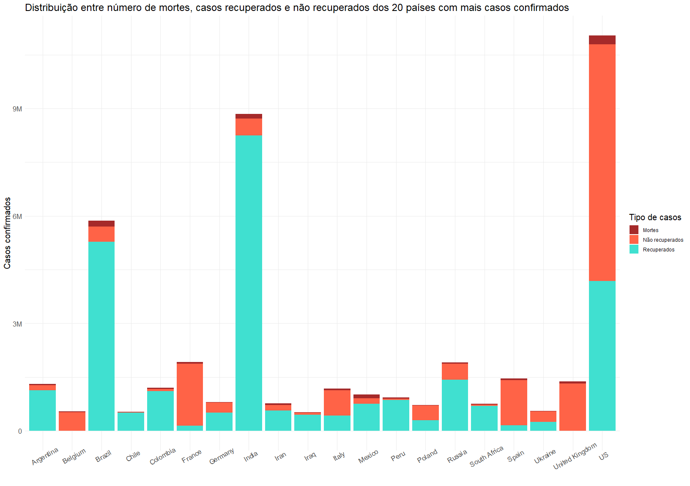
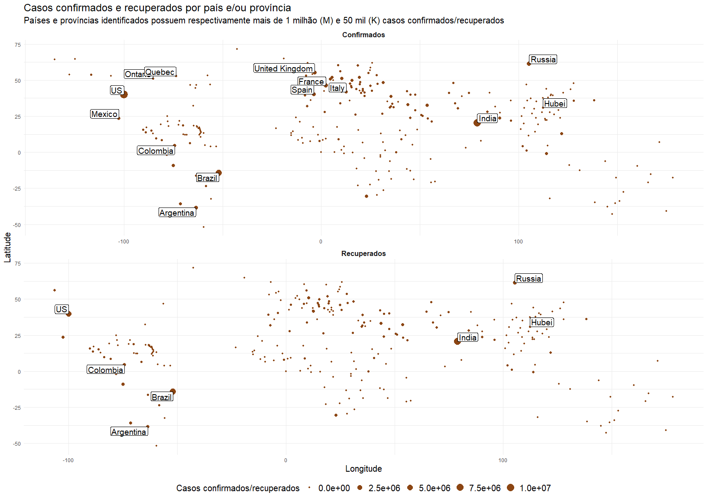
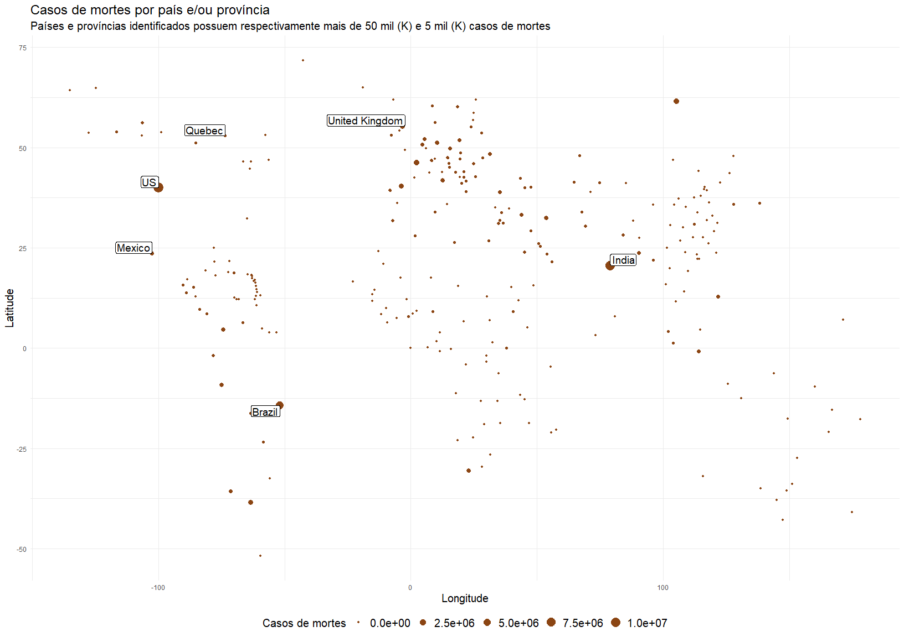
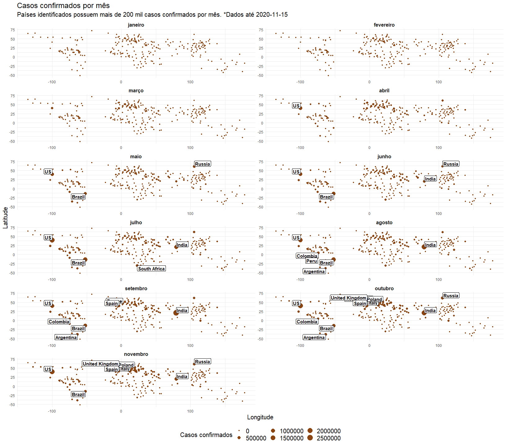
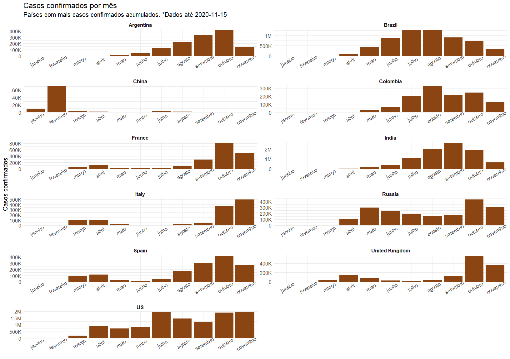
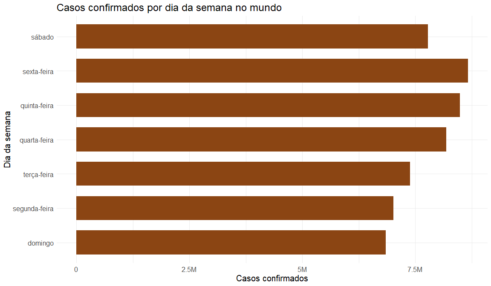
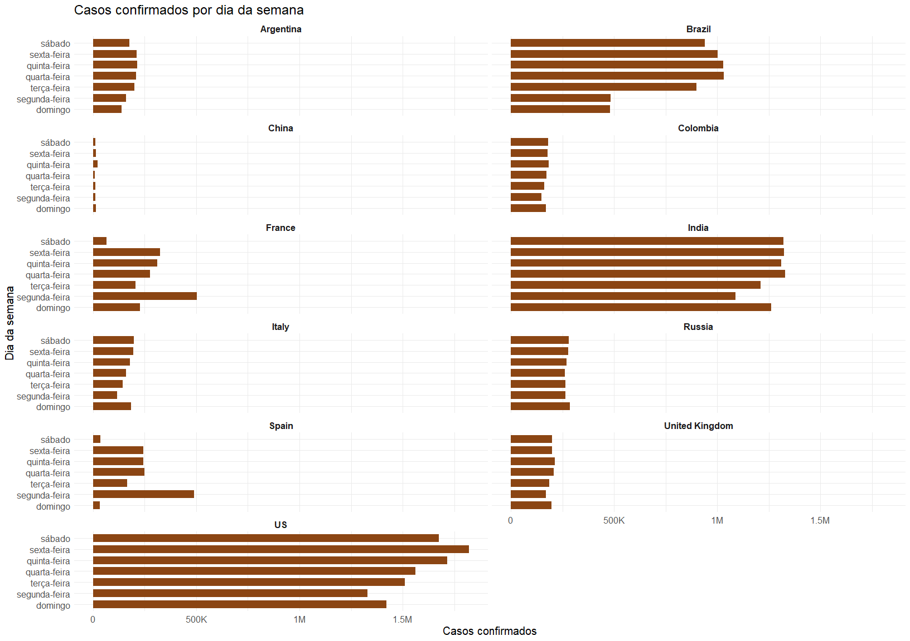

Análise coronavírus com pacote *coronavirus*
================

### Distribuição do número total de casos confirmados entre número de mortes, recuperados e não recuperados.

1.  Para facilitar a visualização das unidades nos eixos foi utilizada a
    função *addUnits* fornecida em
    [addUnits](https://github.com/gabiborges1/projetos/blob/master/presentations/rladies_gyn/analysis/aux_functions.R)

2.  A partir da base completa *coronavirus*, uma nova base nomeada
    *corona.pais* foi gerada pela soma do número de casos por país e por
    tipo.

<!-- end list -->

``` r
corona.pais = coronavirus %>%
  group_by(country, type) %>% 
  summarise(total = sum(cases)) %>% 
  arrange(desc(total))
```

3.  Na base *corona.pais*, os registros com tipo *confirmed* foram
    substituídos pelo tipo *not\_recovered* com o número de não
    recuperados (*not\_recovered = confirmed - (recovered + death)*).
    Desta forma, o número de confirmados pode ser recuperado pela soma
    dos três tipos de casos.

<!-- end list -->

``` r
for(i in unique(corona.pais$country)){
  idx = which(corona.pais$country == i & corona.pais$type == 'confirmed')
  corona.pais$total[idx] = corona.pais$total[idx] - (corona.pais$total[which(corona.pais$country == i & corona.pais$type == 'recovered')] + corona.pais$total[which(corona.pais$country == i & corona.pais$type == 'death')])
}

corona.pais$type[corona.pais$type == 'confirmed'] = 'not_recovered'
```

4.  Para a visualização seguinte, foram selecionados os 20 países com
    maior soma de casos confirmados. Esta lista de países foi gerada
    pela função abaixo:

<!-- end list -->

``` r
top.paises.contaminados = coronavirus %>% 
  filter(type == 'confirmed') %>% 
  group_by(country) %>% 
  summarise(total_casos = sum(cases)) %>% 
  arrange(desc(total_casos))
```

``` r
corona.pais %>%
  filter(country %in% head(top.paises.contaminados$country, 20)) %>% 
ggplot(aes(x = country, y = total, fill = type)) +
  geom_bar(stat = "identity", position = "stack") +
  scale_y_continuous(labels = addUnits) +
  labs(title = 'Distribuição entre número de mortes, casos recuperados e não recuperados dos 20 países com mais casos confirmados', x = NULL, y = 'Casos confirmados', fill = 'Tipo de casos') +
  scale_fill_manual(values = c('brown', 'Tomato', 'Turquoise'), labels = c('Mortes', 'Não recuperados', 'Recuperados')) +
  theme_minimal() +
  theme(title = element_text(size = 15),
        axis.text.x = element_text(angle=30, size = 12), 
        axis.text.y = element_text(size = 12))
```

<!-- -->

  - A maioria dos 20 países com mais casos confirmados possui mais casos
    recuperados e menor número de mortes;
  - Nenhum país apresentou número de mortes superior aos demais tipos de
    casos;
  - Dos 20 países, 7 europeus, Bélgica (Belgium), França, Itália,
    Polônia (Poland), Espanha, Ucrânia (Ukraine), Reino Unido (United
    Kingdom), e os US têm número de casos não recuperados superior ao
    das demais categorias;
  - Pelo gráfico acima, os maiores números de casos estão concentrados
    em países da Europa, América do Norte e Sul.

### Países/províncias e seus números de casos por categoria

  - A partir da base completa *coronavirus*, uma nova base nomeada
    *dc.prov* foi gerada pela soma do número de casos por país, tipo,
    latitude e longitude.

<!-- end list -->

``` r
dc.prov = coronavirus %>%
  group_by(country, province, type, lat, long) %>% 
  summarise(total = sum(cases))
```

``` r
#Nome das labels em cada plot do facet_wrap
type.labels = c('Confirmados', 'Recuperados')
names(type.labels) = c('confirmed', 'recovered')

confirmados.recuperados = ggplot(dc.prov %>% filter(type != 'death'), aes(x = long, y = lat)) +
  geom_point(aes(size = total), color = 'SaddleBrown') +
  facet_wrap(type ~., scale = 'free', nrow = 2, labeller = labeller(type = type.labels)) +
  geom_label(data = dc.prov %>% filter(type != 'death', total > 10^6), aes(x=long, y=lat, label=country), label.padding = unit(0.15, "lines"), size = 5, vjust = "outward", hjust = "outward", check_overlap = TRUE) +
  geom_label(data = dc.prov %>% filter(type != 'death', province != '', total > 5 * 10^4), aes(x=long, y=lat, label=province), check_overlap = TRUE, label.padding = unit(0.15, "lines"), size = 5, vjust = "outward", hjust = "outward") +
  labs(title = 'Casos confirmados e recuperados por país e/ou província', subtitle = 'Países e províncias identificados possuem respectivamente mais de 1 milhão (M) e 50 mil (K) casos confirmados/recuperados', x = 'Longitude', y = 'Latitude', 
       size = 'Casos confirmados/recuperados') +
  theme_minimal() +
  theme(title = element_text(size = 15),
        strip.text.x = element_text(size=12, face="bold"),
        legend.text = element_text(size = 15),
        legend.position = 'bottom')


mortes = ggplot(dc.prov, aes(x = long, y = lat)) +
  geom_point(aes(size = total), color = 'SaddleBrown') +
  geom_label(data = dc.prov %>% filter(type == 'death') %>% group_by(country) %>%  summarise(total = sum(total), lat = max(lat), long = max(long)) %>%  filter(total > 5 * 10^4), aes(x=long, y=lat, label=country), label.padding = unit(0.15, "lines"), size = 5, vjust = "outward", hjust = "outward") +
  geom_label(data = dc.prov %>% filter(type == 'death', province != '', total > 5 * 10^3), aes(x=long, y=lat, label=province), label.padding = unit(0.15, "lines"), size = 5, vjust = "outward", hjust = "outward") +
  labs(title = 'Casos de mortes por país e/ou província', subtitle = 'Países e províncias identificados possuem respectivamente mais de 50 mil (K) e 5 mil (K) casos de mortes', x = 'Longitude', y = 'Latitude', size = 'Casos de mortes') +
  theme_minimal() +
  theme(title = element_text(size = 15), legend.text = element_text(size = 15),
        legend.position = 'bottom')

confirmados.recuperados
```

<!-- -->

``` r
mortes
```

<!-- -->

  - O tamanho e densidade dos pontos mostrada nas visualizações acima
    confirma que o continente europeu é o mais afetado pela pandemia do
    coronavírus com destaque para o número de não recuperados, já que
    nenhum país do continente atingiu 1 milhão de casos recuperados;
  - Como as visualizações são feitas considerando o número absoluto de
    casos, os países que mais se destacam são consequentemente aqueles
    mais populosos como US, Brasil, Rússia, Índia e México;
  - Em contrapartida, países mais populosos do que o Brasil como China,
    Indonésia e Paquistão
    (\[<https://pt.wikipedia.org/wiki/Lista_de_pa%C3%ADses_por_popula%C3%A7%C3%A3o>\])
    não atingiram 1 milhão de casos;
  - Além dos quatro países europeus com mais de 1 milhão de casos
    confirmados, destacam-se a Colômbia e Argentina por não serem países
    com população numericamnente próxima dos demais destacados no
    gráfico;
  - Dentre os registros com dados de províncias, Quebec e Ontário no
    Canadá e Hubei na China foram destacados por terem mais de 50 mil
    casos confirmados;
  - No entanto, destas províncias, somente Hubei atingiu mais de 50 mil
    casos recuperados;
  - Quebec é a única província das identificadas nos gráficos que
    aparece com mais de 5 mil casos de mortes. Não é possível afirmar
    que Quebec deve ser destacada por seus números da doença porque
    muitos países como Brasil, US, Índia, Rússia e México não possuem
    dados de províncias na base e somente 82 províncias têm algum
    registro.

### Casos confirmados nos países por mês

  - A partir da base completa *coronavirus*, uma nova base nomeada
    *dc.mes* foi gerada pela soma do número de casos confirmados por
    país, latitude, longitude e mês.

<!-- end list -->

``` r
dc.mes = coronavirus %>% 
  filter(type == 'confirmed') %>% 
  group_by(country, lat, long, mes = month(date, label = TRUE, abbr = FALSE)) %>% 
  summarise(total_casos = sum(cases))
```

``` r
ggplot(dc.mes, aes(x = long, y = lat, label = country)) +
  geom_point(aes(size = total_casos), color = 'SaddleBrown') +
  facet_wrap(mes ~., scale = 'free', nrow = 6, ncol = 2) +
  geom_label(data = dc.mes %>%  filter(total_casos > 2 * 10^5), check_overlap = TRUE, size = 4, vjust = "outward", hjust = "outward", label.padding = unit(0.15, "lines"), fontface = "bold") +
  labs(title = 'Casos confirmados por mês', subtitle = paste0('Países identificados possuem mais de 200 mil casos confirmados por mês. *Dados até ', max(coronavirus$date)), x = 'Longitude', y = 'Latitude', size = 'Casos confirmados') +
  theme_minimal() +
  theme(title = element_text(size = 15),
        strip.text.x = element_text(size = 12, face = "bold"),
        legend.text = element_text(size = 15),
        legend.position = 'bottom')
```

<!-- -->

  - A visualização acima mostra que até os meses de janeiro, fevereiro e
    março nenhum país havia atingido ou registrado 200 mil casos de
    coronavírus;
  - Deve-se destacar que no período que a China era o epicentro da
    doença (fevereiro e março), seguido da Europa (abril, maio), nenhum
    destes registrou 200 mil casos da doença. Somente a partir de
    setembro que os primeiros países europeus atingiram tal marca;
  - A África do Sul e o Peru foram os únicos países a registrarem 200
    mil casos em somente um mês;
  - Em contrapartirda, os US, Brasil e Índia continuam atingindo pelo
    menos 200 mil casos por mês desde o primeiro mês em que a marca foi
    alcançada. A Colômbia e Argentina podem ser adicionadas a este grupo
    de países dependendo do resgistro total do mês de novembro.

### Casos confirmados por mês na China e nos 10 países com maior número de casos

``` r
dc.mes %>%
    filter(country %in% append('China', head(top.paises.contaminados$country, 10))) %>% 
ggplot(aes(x = mes, y = total_casos)) +
  geom_bar(stat = "identity", fill = 'SaddleBrown') +
  scale_y_continuous(labels = addUnits) +
  facet_wrap(country ~., scale = 'free', nrow = 6, ncol = 2) +
  labs(title = 'Casos confirmados por mês', subtitle = paste0('Países com mais casos confirmados acumulados. *Dados até ', max(coronavirus$date)), x = NULL, y = 'Casos confirmados') +
  theme_minimal() +
  theme(title = element_text(size = 15), 
        axis.text.x = element_text(angle=30, size = 12), 
        axis.text.y = element_text(size = 12), 
        strip.text.x = element_text(size=12, face="bold"))
```

<!-- -->

  - Como epicentro inicial da pandemia, a China apresentou o maior
    registro de casos nos meses de janeiro e fevereiro e desde então o
    número de casos por mês está muito abaixo dos 20 mil;
  - França, Itália, Espanha e Reino Unido apresentam um padrão
    semelhante de registros por mês: alto em março e abril seguido de
    queda até uma nova alta a partir de agosto. Vale destacar que a
    Itália atingiu seu maior número de casos em apenas 15 dias do mês
    de novembro (registros até o dia 15/11) enquanto os países europeus
    restantes atingiram seu máximo no mês de outubro;
  - Além deste países, a Argentina e Russia também tiveram maior número
    de casos registrados em outubro;
  - Apesar da Argentina, Brasil e Colômbia pertencerem ao mesmo
    continente, cada um apresentou um comportamento diferente em cada
    mês;
  - US e Brasil registraram o maior número de casos confirmados da
    doença em julho;
  - Semelhante a Itália, somente com dados até o dia 2020-11-15,
    novembro já é o segundo mês com maior número de casos nos US.

### Casos confirmados por dia da semana

  - A partir da base completa *coronavirus*, uma nova base nomeada
    *dc.semana* foi gerada pela soma do número de casos confirmados por
    país e dia da semana.

<!-- end list -->

``` r
dc.semana = coronavirus %>% 
  filter(type == 'confirmed') %>% 
  group_by(country, semana = wday(date, label = TRUE, abbr = FALSE)) %>% 
  summarise(total_casos = sum(cases))
```

#### Global

``` r
dc.semana %>%  group_by(semana) %>% summarise(total_casos = sum(total_casos)) %>% 
  ggplot(aes(x = total_casos, y = semana)) +
  geom_bar(stat = "identity", fill = 'SaddleBrown', width = 0.7) +
  scale_x_continuous(labels = addUnits) +
  labs(title = 'Casos confirmados por dia da semana no mundo', x = 'Casos confirmados', y = 'Dia da semana') +
  theme_minimal() +
  theme(title =  element_text(size = 15),
        axis.text.x = element_text(size = 12),
        axis.text.y = element_text(size = 12))
```

<!-- -->

  - Ao visualizar o número de casos confirmados por dia da semana
    globalmente, não há uma discrepância entre os dias da semana, sendo
    domingo e segunda os dias com menores resgistros acumulados, e sexta
    e quinta-feira com os maiores.

#### Na China e nos 10 países com maior número de casos confirmados

``` r
dc.semana %>%
    filter(country %in% append('China', head(top.paises.contaminados$country, 10))) %>% 
ggplot(aes(x = total_casos, y = semana)) +
  geom_bar(stat = "identity", fill = 'SaddleBrown', width = 0.7) +
  facet_wrap(country ~., nrow = 6, ncol = 2) +
  scale_x_continuous(labels = addUnits) +
  labs(title = 'Casos confirmados por dia da semana', x = 'Casos confirmados', y = 'Dia da semana') +
  theme_minimal() +
  theme(title = element_text(size = 15),
        axis.text.x = element_text(size = 12), 
        axis.text.y = element_text(size = 12),
        strip.text.x = element_text(size = 12, face="bold"))
```

<!-- -->

  - França e Espanha registraram isoladamente na segunda-feira quase o
    dobro do número de casos dos demais dias da semana;
  - No caso do Brasil, foram registrados no domingo e segunda-feira
    menos que o dobro dos demais dias da semana;
  - Argentina, China, Colômbia, Itália, Rússia e Reino Unido
    registramram valores próximos de casos confirmados durante os dias
    da semana, ou seja, as notificações e registros de casos é bem
    distribuído entre todos os dia da semana.
