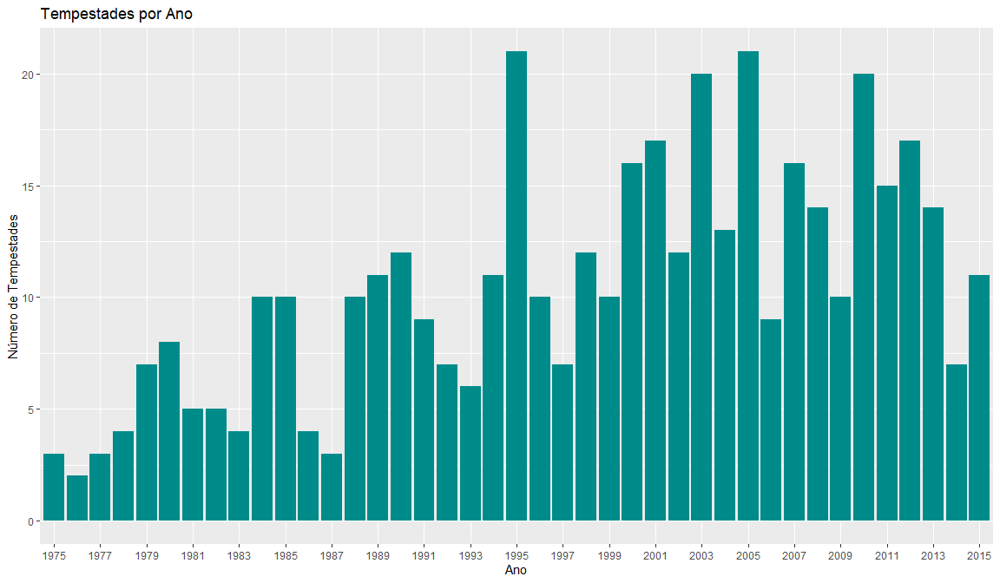
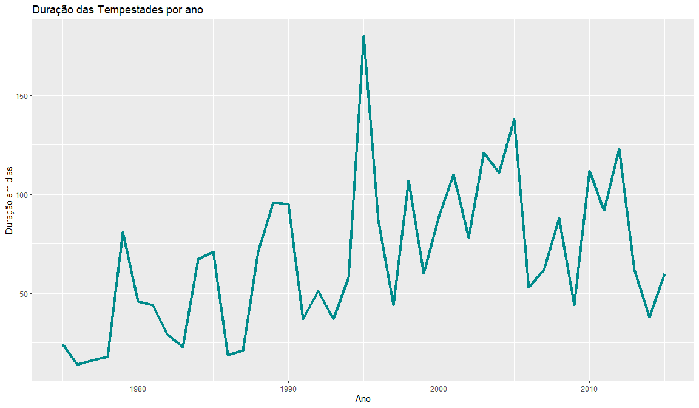
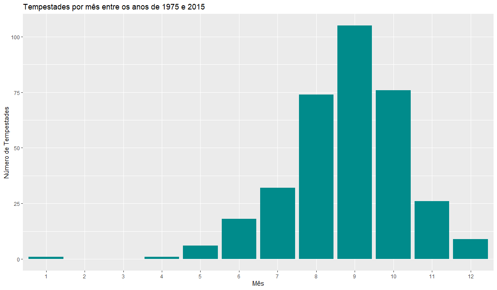
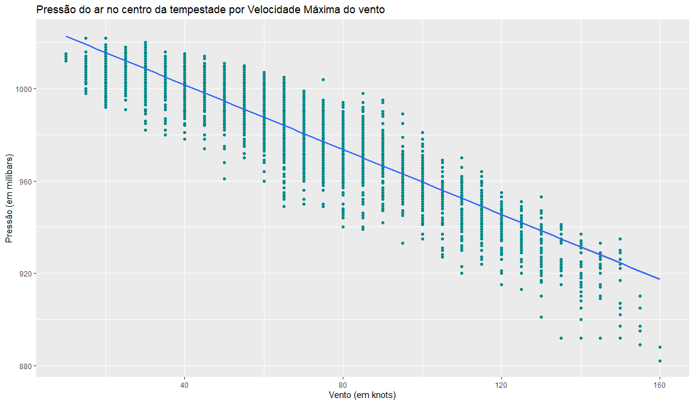
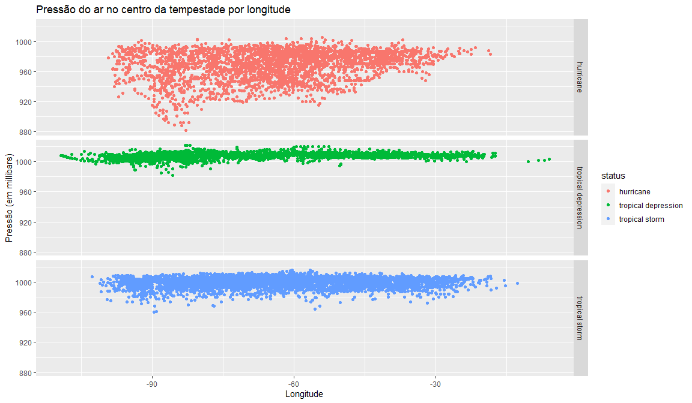

Análise storms dataset
================

Dataset *storms* do pacote **dplyr** apresenta os dados de 198
tempestades tropicais em 10.010 observações e 13 variáveis.

``` r
data('storms')
head(storms)
```

    ## # A tibble: 6 x 13
    ##   name   year month   day  hour   lat  long status category  wind pressure
    ##   <chr> <dbl> <dbl> <int> <dbl> <dbl> <dbl> <chr>  <ord>    <int>    <int>
    ## 1 Amy    1975     6    27     0  27.5 -79   tropi~ -1          25     1013
    ## 2 Amy    1975     6    27     6  28.5 -79   tropi~ -1          25     1013
    ## 3 Amy    1975     6    27    12  29.5 -79   tropi~ -1          25     1013
    ## 4 Amy    1975     6    27    18  30.5 -79   tropi~ -1          25     1013
    ## 5 Amy    1975     6    28     0  31.5 -78.8 tropi~ -1          25     1012
    ## 6 Amy    1975     6    28     6  32.4 -78.7 tropi~ -1          25     1012
    ## # ... with 2 more variables: ts_diameter <dbl>, hu_diameter <dbl>

### Número de tempestades por ano

``` r
storms.year.dias = storms %>% 
  group_by(name, year) %>% 
  summarise(dias_tempestades = length(unique(day)))
```

``` r
storms.year.dias %>% 
  ggplot(aes(x = as.character(year))) +
    geom_bar(fill = 'DarkCyan') +
    labs(title = 'Tempestades por Ano', y = 'Número de Tempestades', x = 'Ano') +
    scale_x_discrete(breaks = as.character(seq(1975, 2015, 2)))
```

<!-- -->

Ao visualizar o número de tempestades por ano através do gráfico de
barras, pôde-se observar que os anos de 1995 e 2005 tiveram maior
ocorrência de tempestades (21 no total) com destaque para a década de
2000 a 2010 que obteve maior incidência de tempestades em relação as
demais décadas.

### Duração das tempestades em dias

``` r
storms.year.dias %>% 
   group_by(year) %>% 
   summarise(dias_tempestades = sum(dias_tempestades)) %>% 
ggplot(aes(x = year, y = dias_tempestades)) +
    geom_line(size = 1.5, color = 'DarkCyan') + 
    labs(title = 'Duração das Tempestades por ano', y = 'Duração em dias', x = 'Ano')
```

<!-- -->

Visualizando a duração em dias das tempestades por ano, percebe-se que,
isoladamente, o ano de 1995 teve mais dias de tempestade e maior número
delas (gráfico anterior) do que os demais. Através do gráfico anterior
verificou-se que o ano de 2005 teve a mesma quantidade de tempestades de
1995 mas, pelo gráfico de linhas abaixo, elas tiveram menos tempo de
duração em dias.

### Número de tempestades por mês

``` r
storms %>% 
  group_by(month) %>% 
  summarise(tempestades = length(unique(name))) %>% 
  ggplot(aes(x = month, y = tempestades)) +
    geom_col(fill = 'DarkCyan') +
    labs(title = 'Tempestades por mês entre os anos de 1975 e 2015', y = 'Número de Tempestades', x = 'Mês') +
    xlim(as.character(c(1:12)))
```

<!-- -->

Ao visualizar o número de tempestades por mês, percebeu-se que o mês de
setembro foi aquele que sofreu com a maior ocorrência de tempestades,
seguido dos mêses de outubro e agosto. As tempestades estão
majoritariamente concentradas nestes três meses e no segundo semestre do
ano.

### Pressão do ar por Vento

``` r
ggplot(storms, aes(x = wind, y = pressure)) +
  geom_point(color = 'DarkCyan') +
  geom_smooth(method = 'lm') +
  labs(title = 'Pressão do ar no centro da tempestade por Velocidade Máxima do vento', y = 'Pressão (em millibars)', x = 'Vento (em knots)')
```

<!-- -->

Visualizando a pressão do ar no centro da tempestade (**pressure**) e a
velocidade máxima dos ventos (**wind**), verificou-se que estas duas
variáveis são inversamente relacionadas: à medida que a pressão diminui,
a velocidade dos ventos aumenta.

### Longitude x Pressão

``` r
ggplot(storms, aes(x = long, y = pressure)) +
  geom_point(aes(color = status)) +
  facet_grid(status ~ .) +
  labs(title = 'Pressão do ar no centro da tempestade por longitude', x = 'Longitude', y = 'Pressão (em millibars)')
```

<!-- -->

Pelo diagrama de dispersão da pressão do ar no centro da tempestade
(**pressure**) pela longitude das mesmas (**long**), pôde-se visualizar
que as tempestades, independende da sua categoria (status), se localizam
aproximadamente no mesmo espaço horizontal (longitude). Contudo, é
possivel perceber que a tempestade do tipo *tropical depression*
apresenta maior distribuição horizontal do que as demais. No entanto, o
oposto ocorre com a pressão do ar, na qual as tempestades *tropical
storm* e especialmente a *hurricane* têm uma maior variação de pressão
em seus centros.
