Google Trends análise interesse Brasil
================

``` r
library(gtrendsR)
library(ggplot2)
library(dplyr)
library(patchwork)
```

O Google Trends foi utilizado para responder a questões relacionadas ao
Brasil em diferentes aspectos (cultural, político, ambiental,
esportivo), visualizar quais os países que mais mais interessados sobre
o Brasil e o que é mais buscado no mundo sobre o país.

  - Palavra chave: *brazil*

<!-- end list -->

``` r
brasil = gtrends(c('brazil'), time = "all")
```

``` r
ggplot(brasil$interest_over_time, aes(x = as.Date(date), y = hits)) +
  geom_line(aes(col = paste(keyword, '-', geo)), size = 1.25) +
  labs(title = expression(paste('Interesse ao longo do tempo pela palavra chave ', italic('Brazil'))), x = 'Ano', y = 'Interesse', col = 'Busca') +
  scale_color_manual(values = 'LimeGreen') + 
  scale_x_date(NULL, date_labels = "%b/%Y", breaks = seq.Date(from = as.Date('2006-06-01'), to = as.Date('2020-06-01'), by = '4 year')) +
  theme_minimal()
```

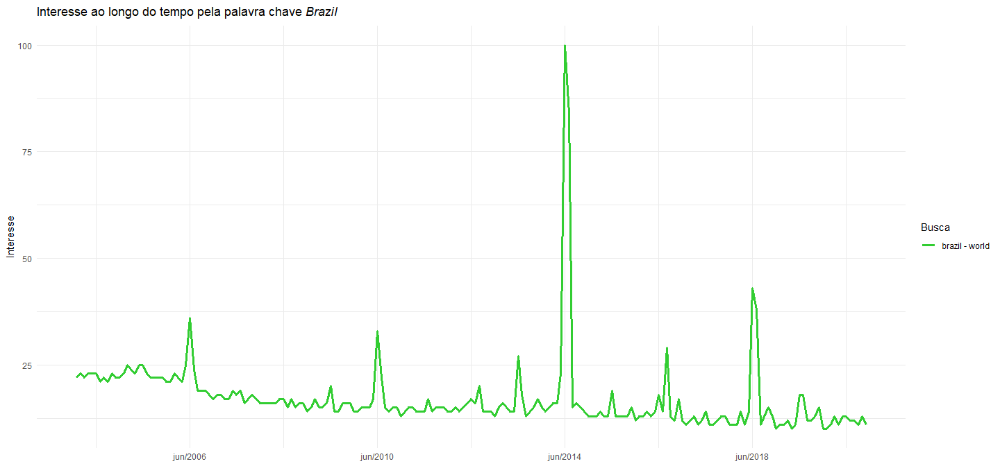<!-- -->

Pelo gráfico de linha acima foi possível perceber que os *picos* de
busca pela palavra chave *brazil* coincidiram com os anos de copa do
mundo, com destaque para a copa de 2014 sediada no país.

  - Palavras chave: *brazil* e *brazil world cup*

<!-- end list -->

``` r
brasil.copa = gtrends(c("brazil", 'brazil world cup'), time = "all") 

brasil.copa = brasil.copa$interest_over_time %>% 
  mutate(hits = as.numeric(hits), date = as.Date(date)) %>% 
  filter(!is.na(hits))
```

``` r
ggplot(brasil.copa, aes(x = date, y = hits, group=keyword)) +
  geom_line(aes(col = paste(keyword, '-', geo)), size = 1.25) +
  labs(title = expression(paste('Interesse ao longo do tempo pelas palavras chave ', italic('Brazil') , ' e ', italic('Brazil world cup'))), x = 'Ano', y = 'Interesse', col = 'Busca') +
  scale_color_manual(values = c('LimeGreen', 'blue')) + 
  scale_x_date(NULL, date_labels = "%b/%Y", breaks = seq.Date(from = as.Date('2006-06-01'), to = as.Date('2020-06-01'), by = '4 year')) +
  theme_minimal()
```

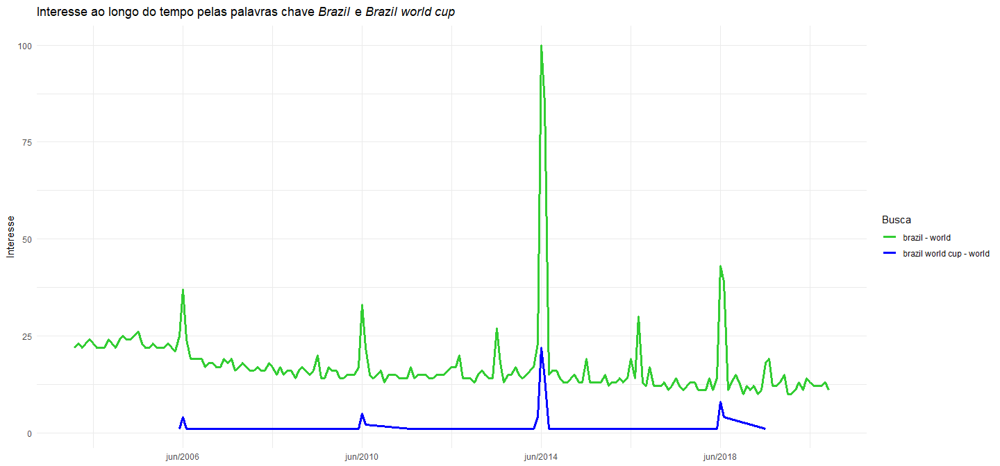<!-- -->

Ao visualizar o gráfico de linha com as duas palavras chave *brazil* e
*brazil world cup*, percebeu-se que os períodos de maior busca por
*brazil* realmente coindiram com os de maior busca por *brasil world
cup*.

  - Tópicos e queries relacionadas à busca por *brazil*

<!-- end list -->

``` r
topicos = brasil$related_topics %>% 
  filter(related_topics == 'top', subject > 0, value != 'Brazil') %>% 
  mutate(value = factor(value, 
                        levels = value[order(as.numeric(subject))])) %>% 
  ggplot(aes(x = as.numeric(subject), y = value)) +
  geom_bar(fill = 'LimeGreen', stat = "identity") +
  labs(title = 'Tópicos Relacionados à busca sobre Brazil', x = NULL, y = NULL) +
  theme_minimal() +
  theme(axis.text.y = element_text(size=12)) 

queries = brasil$related_queries %>% 
  filter(related_queries == 'top', subject > 0, value != 'Brazil') %>%
  mutate(value = factor(value, 
                        levels = value[order(as.numeric(subject))])) %>% 
  ggplot(aes(x = as.numeric(subject), y = value)) +
  geom_bar(fill = 'LimeGreen', stat = "identity") +
  labs(title = 'Perguntas (queries) Relacionadas à busca sobre Brazil', x = NULL, y = NULL) +
  theme_minimal() +
  theme(axis.text.y = element_text(size=12)) 

(topicos + queries)
```

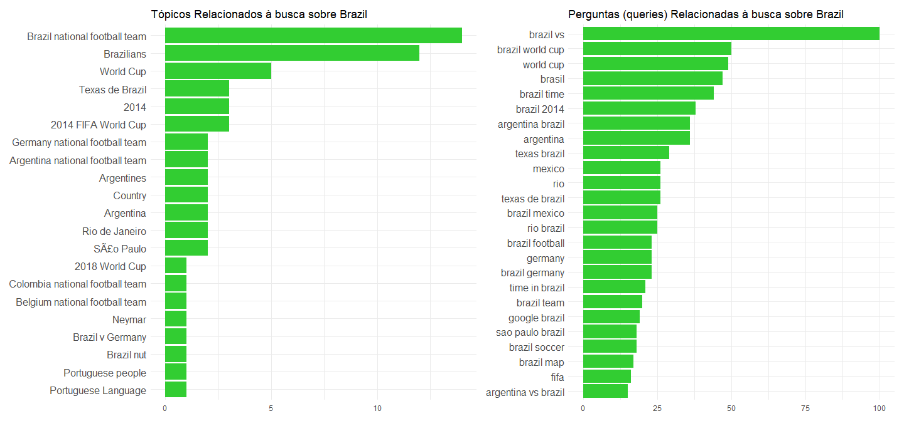<!-- -->

A visualização acima confirmou a indicação do primeiro gráfico que as
buscas por *brazil* estão relacionadas a futebol e copa do mundo.

  - Países mais interessados pela palavra chave *brazil*

<!-- end list -->

``` r
brasil$interest_by_country %>% 
  mutate(hits = as.numeric(hits)) %>% 
  filter(hits > 20) %>% 
  arrange(desc(hits)) %>% 
  select(location, hits) %>% 
  mutate(location = factor(location, 
                        levels = location[order(hits, decreasing = TRUE)],
                        ordered=TRUE)) %>% 
  ggplot(aes(x = location, y = hits)) +
  geom_col(fill = 'LimeGreen') + 
  labs(title = expression(paste('Interesse por país na palavra chave ', italic('Brazil'))), x = 'País', y = 'Interesse') + 
  theme_minimal() +
  theme(axis.text.x = element_text(angle=30, size = 11))
```

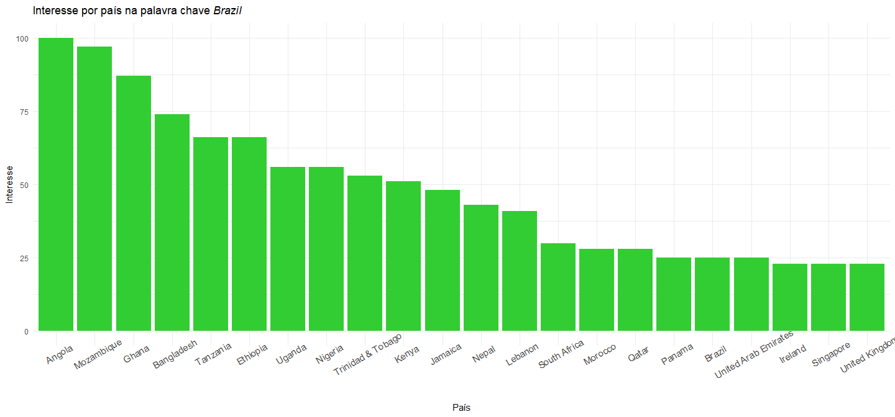<!-- -->

Pelo gráfico de colunas acima, verificou-se que os países do continente
africano foram os mais interessados sobre o Brazil.

  - Palavras chave: *brazilian culture*, *brazilian carnival*,
    *brazilian dance* e *brazilian music*, *brazilian film* e *brazilian
    soap opera*

<!-- end list -->

``` r
cultura = ggplot(gtrends(c('brazilian culture'), time = "all")$interest_over_time, aes(x = as.Date(date), y = hits)) +
  geom_line(aes(col = paste(keyword, '-', geo)), size = 1.25) +
  labs(title = expression(paste('Interesse ao longo do tempo pela palavra chave ', italic('brazilian culture'))), x = 'Ano', y = 'Interesse', col = 'Busca') +
  scale_color_manual(values = 'gold') + 
  scale_x_date(date_labels = "%b/%Y", date_breaks = "2 year") +
  theme_minimal() +
  theme(legend.position = 'bottom')

carnaval = ggplot(gtrends(c('brazilian carnival'), time = "all")$interest_over_time, aes(x = as.Date(date), y = hits)) +
  geom_line(aes(col = paste(keyword, '-', geo)), size = 1.25) +
  labs(title = expression(paste('Interesse ao longo do tempo pela palavra chave ', italic('brazilian carnival'))), x = 'Ano', y = 'Interesse', col = 'Busca') +
  scale_color_manual(values = 'orange') + 
  scale_x_date(NULL, breaks = seq.Date(from = as.Date('2004-02-01'), to = as.Date('2020-02-01'), by = '2 year'), date_labels = "%b/%Y") + 
  theme_minimal() +
  theme(legend.position = 'bottom')

cultura / carnaval
```

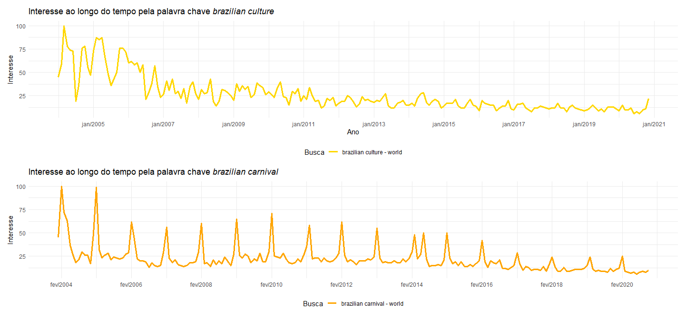<!-- -->

``` r
musica.danca = ggplot(gtrends(c('brazilian dance', 'brazilian music'), time = "all")$interest_over_time, aes(x = as.Date(date), y = hits)) +
  geom_line(aes(col = paste(keyword, '-', geo)), size = 1.25) +
  labs(title = expression(paste('Interesse ao longo do tempo pelas palavras chave ', italic('brazilian dance') , ' e ', italic('brazilian music'))), x = 'Ano', y = 'Interesse', col = 'Busca') +
  scale_color_manual(values = c('blue', 'magenta')) + 
  scale_x_date(NULL, date_labels = "%b/%Y", date_breaks = "2 year") +
  theme_minimal() +
  theme(legend.position = 'bottom')

film.tv = ggplot(gtrends(c('brazilian film', 'brazilian soap opera'), time = "all")$interest_over_time, aes(x = as.Date(date), y = hits)) +
  geom_line(aes(col = paste(keyword, '-', geo)), size = 1.25) +
  labs(title = expression(paste('Interesse ao longo do tempo pelas palavras chave ', italic('brazilian film'), ' e ', italic('soap opera'))), x = 'Ano', y = 'Interesse', col = 'Busca') +
  scale_color_manual(values = c('DarkSlateGray', 'red')) + 
  scale_x_date(NULL, date_labels = "%b/%Y", date_breaks = "2 year") +
  theme_minimal() +
  theme(legend.position = 'bottom')

musica.danca/film.tv
```

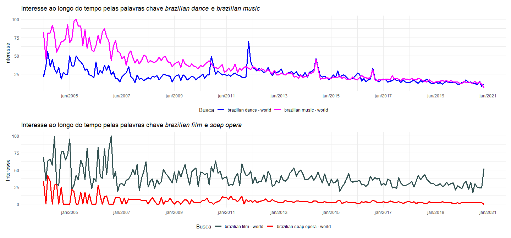<!-- -->

Os quatro gráficos de linha mostraram que o interesse pela cultura e
produções brasileiras caíram ao longo do tempo, tendo sido mais altas,
em geral, até 2010.

Pelo gráfico de interesse por *brazilian dance* e *brazilian music*,
percebeu-se que o interesse pela música foi consideravelmente superior
até 2010, enquanto o interesse pela dança foi mais constante com
pequenas oscilações, tendo algumas vezes superado a música de 2011 a
2016.

Em relação ao interesse pelo carnaval, apesar de ter seguido a tendência
decrescente das demais palavras chave, o interesse oscilou
periodicamente, com as maiores buscas tendo sido realizadas no mês de
fevereiro.

Já o interesse pelas produções cinematográficas e de novelas, a
visualização mostrou que o interesse pelos filmes brasileiros foi
superior, em todos os anos, ao interesse pelas novelas.

  - Palavras chave: *amazon rainforest*, *brazilian amazon rainforest* e
    *brazil burning*

<!-- end list -->

``` r
floresta = ggplot(gtrends(c('amazon rainforest'), time = "all")$interest_over_time, aes(x = as.Date(date), y = hits)) +
  geom_line(aes(col = paste(keyword, '-', geo)), size = 1.25) +
  labs(title = expression(paste('Interesse ao longo do tempo pela palavra chave ', italic('amazon rainforest'))), x = 'Ano', y = 'Interesse', col = 'Busca') +
  scale_color_manual(values = c('ForestGreen')) + 
  scale_x_date(NULL, date_labels = "%b/%y", date_breaks = "2 year") +
  theme_minimal() + 
  theme(legend.position = 'bottom')

brazilian.amazon = gtrends(c('brazilian amazon rainforest'), time = "all")
brasil.floresta = ggplot(brazilian.amazon$interest_over_time, aes(x = as.Date(date), y = hits)) +
  geom_line(aes(col = paste(keyword, '-', geo)), size = 1.25) +
  labs(title = expression(paste('Interesse ao longo do tempo pela palavra chave ', italic('brazilian amazon rainforest'))), x = 'Ano', y = 'Interesse', col = 'Busca') +
  scale_color_manual(values = c('ForestGreen')) + 
  scale_x_date(NULL, date_labels = "%b/%y", date_breaks = "2 year") +
  theme_minimal() +
  theme(legend.position = 'bottom')

queimada.floresta = ggplot(gtrends(c('brazil burning'), time = "all")$interest_over_time, aes(x = as.Date(date), y = hits)) +
  geom_line(aes(col = paste(keyword, '-', geo)), size = 1.25) +
  labs(title = expression(paste('Interesse ao longo do tempo pelas palavras chave ', italic('brazil burning'), ' e ', italic('brazilian amazon rainforest'))), x = 'Ano', y = 'Interesse', col = 'Busca') +
  scale_color_manual(values = c('brown', 'ForestGreen')) + 
  scale_x_date(NULL, date_labels = "%b/%Y", date_breaks = "2 year") +
  theme_minimal() +
  theme(legend.position = 'bottom')

(floresta + brasil.floresta)/queimada.floresta
```

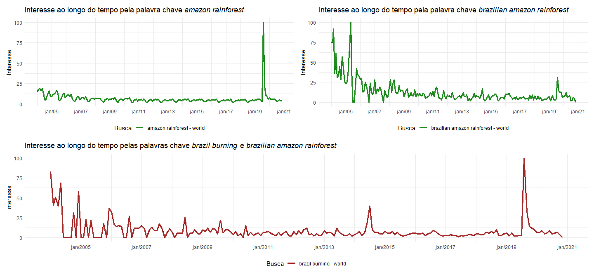<!-- -->

Através da visualização da busca pela palavra chave *amazon rainforest*,
percebeu-se que o interesse pela floresta amazônica foi máximo no ano de
2019 devido às fortes queimadas, que chamaram a atenção do mundo,
registradas no ano.

No entanto, a busca pela floresta amazônica especificamente brasileira
não acompanhou proporcionalmente o interesse geral pela floresta
amazônica mostrada no primeiro gráfico. Apesar do ano de 2019 também
ter apresentado uma elevação nas buscas, foi no período de 2004 a 2008
que a busca por *brazilian amazon rainforest* foi mais alta.

A palavra chave *brazilian burning* apresentou um gráfico de interesse
próximo do encontrado ao utilizar *amazon rainforest*, com pico de
buscas no ano de 2019. Entretanto, altos valores também foram
registrados mais constantemente até o ano de 2007, com pico isolado em
2014 e máximo valor em 2019. Deve-se salientar, que a palavra chave de
busca é subjetiva: *burning* pode ter sido utilizado no sentido literal
não só para queimadas em floresta, mas em casos de grandes incêndios,
por exemplo, ou no sentido figurado como sinônimo de inquietação,
manifestação, possivelmente de cunho político.

  - Países mais interessados pela palavra chave *brazilian amazon
    rainforest*

<!-- end list -->

``` r
brazilian.amazon$interest_by_country %>% 
  filter(hits > 1)
```

    ##         location hits                     keyword   geo gprop
    ## 1 United Kingdom  100 brazilian amazon rainforest world   web
    ## 2  United States   38 brazilian amazon rainforest world   web

Ao verificar quais países apresentaram maior interesse na busca sobre
floresta amazônica brasileira, a função gtrends mostrou que somente os
Estados Unidos fizeram esta busca.

  - Tópicos relacionados à palavra chave *brazilian amazon rainforest*

<!-- end list -->

``` r
brazilian.amazon$related_topics %>% 
  filter(related_topics == 'top', subject > 0) %>%
  mutate(value = factor(value, 
                        levels = value[order(as.numeric(subject))])) %>% 
  ggplot(aes(x = as.numeric(subject), y = value)) +
  geom_bar(fill = 'ForestGreen', stat = "identity") +
  labs(title = 'Tópicos Relacionados à busca sobre a Floresta amazônica brasileira', x = NULL, y = NULL) +
  theme_minimal() +
  theme(axis.text.y = element_text(size=12)) 
```

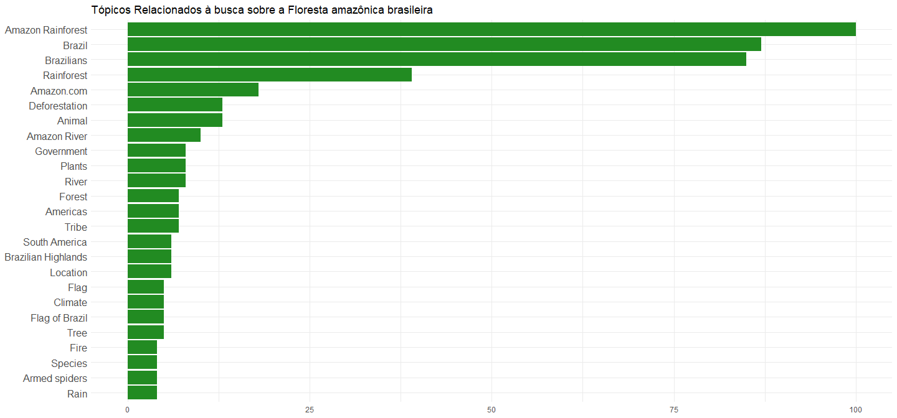<!-- -->

Dentre os tópicos relacionados à busca pela floresta amazônica
brasileira (*brazilian amazon rainforest*), os mais buscados são termos
presentes na palavra chave, como **amazon rainforest**, **brazil**,
**brazilians**, **rainforest**, mas o quinto tópico (**Amazon.com**) se
trata do site de e-commerce. No entanto, os tópicos mais interessantes
são aqueles que demostram a preocupação com a floresta e sua destruição
como **Animal**, **River**, **Government**, **Climate** e **Food**.

  - Perspectiva da Corrupção no Brasil e Mundo, palavras chave:
    *corrupção* e *brazilian corruption*

<!-- end list -->

``` r
corrupcao.brasil = gtrends(c('corrupção'), geo = c('BR'), time = "all")

corrupcao = ggplot(corrupcao.brasil$interest_over_time, aes(x = as.Date(date), y = hits)) +
  geom_line(aes(col = paste(keyword, '-', geo)), size = 1.25) +
  labs(title = expression(paste('Interesse ao longo do tempo pela palavra chave ', italic('corrupção'), ' no Brasil')), x = NULL, y = 'Interesse', col = 'Busca') +
  scale_color_manual(values = c('Chocolate')) + 
  scale_x_date(breaks = seq.Date(from = as.Date('2004-01-01'), to = as.Date('2021-01-01'), by = '1 year'), date_labels = "%b/%y") +
  theme_minimal() +
  theme(legend.position = 'bottom')

corruption = ggplot(gtrends(c('brazilian corruption'), time = "all")$interest_over_time, aes(x = as.Date(date), y = hits)) +
  geom_line(aes(col = paste(keyword, '-', geo)), size = 1.25) +
  labs(title = expression(paste('Interesse ao longo do tempo pela palavra chave ', italic('brazilian corruption'), ' no mundo')), x = 'Ano', y = 'Interesse', col = 'Busca') +
  scale_color_manual(values = c('Chocolate')) + 
  scale_x_date(breaks = seq.Date(from = as.Date('2004-01-01'), to = as.Date('2021-01-01'), by = '1 year'), date_labels = "%b/%y") +
  theme_minimal() +
  theme(legend.position = 'bottom')

corrupcao / corruption
```

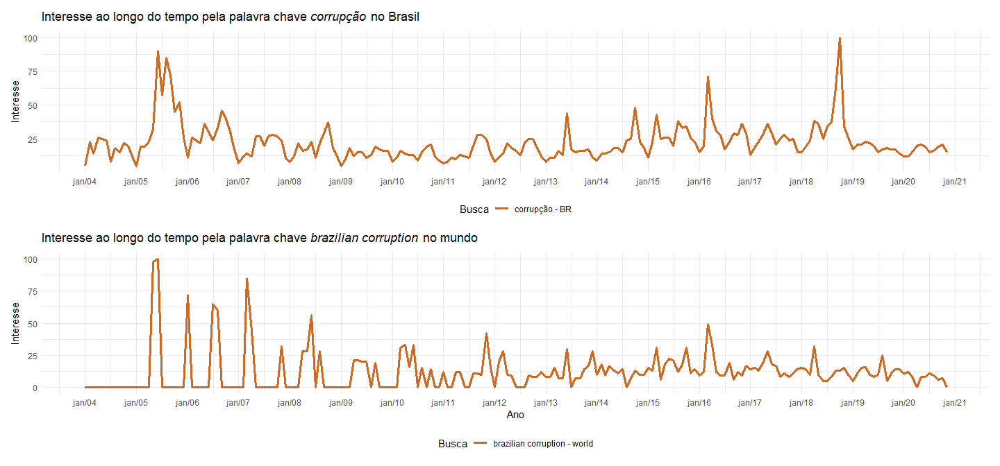<!-- -->

Ao visualizar o interesse pela palavra *corrupção* no Brasil, foi
possível perceber um padrão de picos e vales: os vales (quedas) foram
registrados de maneira padrão no ínicio (janeiro), meio (junho) e final
do ano (dezembro). Estes três meses coincidem com o período de férias no
Brasil, podendo então ser um grande indicador para perda de interesse
sobre corrupção nestes meses.

O mesmo padrão não foi observado no gráfico do interesse pela corrupção
brasileira pelos países. A tendência de busca pela palavra diminuiu ao
longo do tempo com maior interesse entre 2005 e 2009.

  - Estados brasileiros mais interessados pela palavra chave *corrupção*

<!-- end list -->

``` r
corrupcao.brasil$interest_by_region %>% 
  mutate(location = gsub('State of ', '', location),
         location = gsub('ã', 'ã', location),
         location = gsub('á', 'á', location),
         location = gsub('ô', 'ô', location),
         location = gsub('Ã', 'í', location),
         location = factor(location, levels = location[order(hits)])) %>% 
  ggplot(aes(x = hits, y = location)) +
  geom_bar(fill = 'chocolate', stat = "identity") +
  labs(title = expression(paste('Estados brasileiros com maior interesse na palavra chave ', italic('corrupção'))), x = NULL, y = NULL) +
  theme_minimal() +
  theme(axis.text.y = element_text(size=11)) 
```

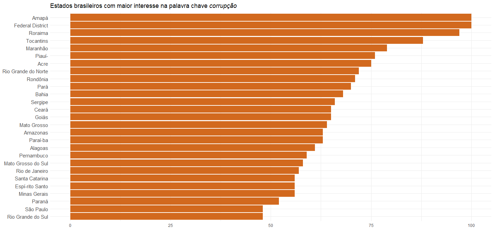<!-- -->

Os estados das regiões norte e nordeste, com exceção do Distrito
Federal, foram os que mais buscaram sobre a palavra *corrupção* durante
o período de 2004 a 2020.

  - Palavras chave: *brazilian election* e *brazilian president*

<!-- end list -->

``` r
gtrends(c('brazilian election', 'brazilian president'), time = "all")$interest_over_time %>% 
  mutate(hits = as.numeric(hits)) %>% 
  filter(!is.na(hits)) %>% 
ggplot(aes(x = as.Date(date), y = hits)) +
  geom_line(aes(col = paste(keyword, '-', geo)), size = 1.25) +
  labs(title = expression(paste('Interesse ao longo do tempo pelas palavras chave ', italic('brazilian election'), ' e ', italic('brazilian president'), ' no mundo')), x = 'Ano', y = 'Interesse', col = 'Busca') +
  scale_x_date(breaks = seq.Date(from = as.Date('2004-01-01'), to = as.Date('2021-01-01'), by = '1 year'), date_labels = "%Y") +
  theme_minimal() +
  theme(legend.position = 'bottom')  
```

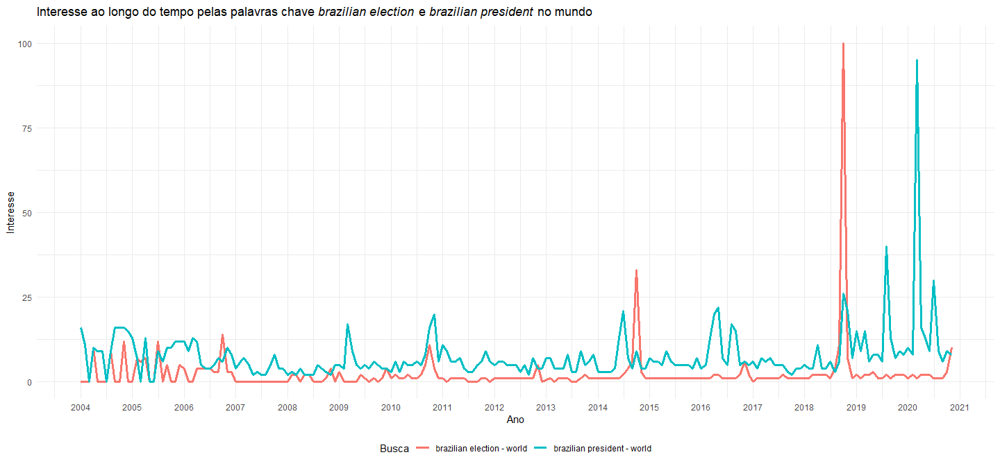<!-- -->
