Análise da Pesquisa Nacional por Amostra de Domicílios (PNAD) COVID do
mês de Novembro de 2020
================

Análise realizada como atividade final do curso **ACIEPE: análise e
visualização de dados do coronavírus usando R** do Departamento de
Economia da Universidade Federal de São Carlos ministrado pela
professora Profa. Dra. Andreza A. Palma.

## Dados da PNAD COVID

Os dados (PNAD_COVID_112020.csv) e o dicionário com a descrição das variáveis (Dicionario_PNAD_COVID_112020.xls) podem ser baixados via **ftp** como mostrado em <https://analisemacro.com.br/data-science/dicas-de-rstats/analise-de-microdados-da-pnad-covid-com-o-r/>.

<!-- end list -->

``` r
# Download dos dados
url = "ftp://ftp.ibge.gov.br/Trabalho_e_Rendimento/Pesquisa_Nacional_por_Amostra_de_Domicilios_PNAD_COVID19/Microdados/Dados/PNAD_COVID_112020.zip"
download.file(url, destfile='PNAD_COVID_112020.zip', mode='wb')
unzip('PNAD_COVID_112020.zip')
```

```r
## Download do dicionário dos dados
url_2 = "ftp://ftp.ibge.gov.br/Trabalho_e_Rendimento/Pesquisa_Nacional_por_Amostra_de_Domicilios_PNAD_COVID19/Microdados/Documentacao/Dicionario_PNAD_COVID_112020.xls"
download.file(url_2, destfile='Dicionario_PNAD_COVID_112020.xls', mode='wb')
```

``` r
pnad_covid = read_csv("PNAD_COVID_112020.csv", col_types = cols(.default = "d")) %>% 
   as_survey_design(ids = UPA, strata = Estrato, weights = V1032, nest = TRUE)
```

# PNAD - Educação

``` r
pnad_escola = pnad_covid %>% mutate(one = 1,
                      escola = ifelse(A006A == 1, "Pública", "Privada"),
                      aula_presencial = factor(case_when(
                               A006B == 1 ~ "Sim, normalmente",
                               A006B == 2 ~ "Sim, mas apenas parcialmente", 
                               A006B == 3 ~ "Não, e meu normalmente é presencial/semipresencial", 
                               A006B == 4 ~ "Não, meu curso é online"), 
                               levels = c('Sim, normalmente', 'Sim, mas apenas parcialmente',
                                        'Não, e meu normalmente é presencial/semipresencial',
                                        'Não, meu curso é online')),
                      homework = factor(case_when(
                               A007 == 1 ~ "Sim, e realizou pelo menos parte delas",
                               A007 == 2 ~ "Sim, mas não realizou (por qualquer motivo)", 
                               A007 == 3 ~ "Não", 
                               A007 == 4 ~ "Não, porque estava de férias"),
                               levels = c('Sim, e realizou pelo menos parte delas',
                                          'Sim, mas não realizou (por qualquer motivo)',
                                          'Não', 'Não, porque estava de férias')),
                      razao_naohomework = factor(case_when(
                               A007A == 1 ~ "Equipamento",
                               A007A == 2 ~ "Internet", 
                               A007A == 3 ~ "Saúde", 
                               A007A == 4 ~ "Afazeres domésticos/família",
                               A007A == 5 ~ "Concentração"),
                               levels = c('Equipamento', 'Internet', 'Saúde', 'Afazeres domésticos/família', 'Concentração')))
```

## Distribuição de alunos que frequentam escola/faculdade que estão com/sem aulas presenciais por rede de ensino (pública ou privada)

``` r
pnad_escola %>%   
          group_by(escola, aula_presencial) %>%
          summarise(freq_escola = survey_prop()) %>% 
          mutate(freq_escola = freq_escola * 100) %>% 
          drop_na() %>% 
ggplot(aes(x = escola, y = freq_escola, fill = escola)) +
   geom_bar(stat = "identity") +
   facet_wrap(~aula_presencial) +
   labs(title = 'Distribuição de aulas presenciais por rede de ensino a partir da pergunta: "Você está tendo aulas presenciais?"', x = NULL, y = 'Frequenta escola (%)') +
   theme_bw() +
   theme(title = element_text(size = 14),
        strip.text.x = element_text(size=12, face="bold"),
        legend.text = element_text(size = 15),
        axis.title.y = element_text(size = 12),
        legend.position = 'none')
```

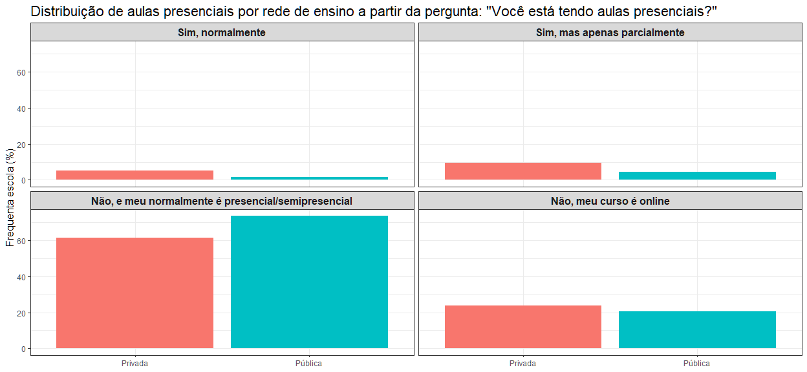<!-- -->

## Distribuição de alunos com atividades para casa por semana do mês de Novembro

``` r
pnad_freq_homework = pnad_escola %>%
  rename(semana_pesquisa = V1012) %>% 
  group_by(escola, homework, semana_pesquisa) %>% 
  summarise(freq_homework = survey_prop()) %>% 
    mutate(semana_pesquisa = paste0('Semana ', semana_pesquisa),
           freq_homework = freq_homework * 100) %>% 
  drop_na()

ggplot(pnad_freq_homework, aes(x = freq_homework, y = homework, fill = escola)) +
  geom_bar(stat = "identity", position = "stack") +
  facet_wrap(~semana_pesquisa) + 
  labs(title = 'Distribuição de alunos com atividades para casa por semana do mês de Novembro', fill = 'Escola/Faculdade', y = NULL, x = 'Alunos com atividades (%)') +
  theme_minimal() +
  theme(title = element_text(size = 13),
        strip.text.x = element_text(size=12, face="bold"),
        legend.text = element_text(size = 12),
        axis.title.x = element_text(size = 12),
        legend.position = 'bottom')
```

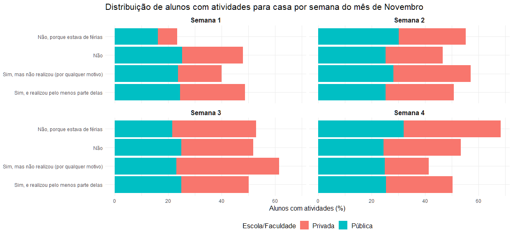<!-- -->

## Razão pelos alunos não terem realizado as atividades da semana anterior do mês de Novembro

``` r
pnad_freq_motivo = pnad_escola %>%
  rename(semana_pesquisa = V1012) %>% 
  group_by(escola, razao_naohomework, semana_pesquisa) %>% 
  summarise(freq_motivo = survey_prop()) %>% 
  mutate(semana_pesquisa = paste0('Semana ', semana_pesquisa),
         freq_motivo = freq_motivo * 100) %>%
  drop_na()
  
ggplot(pnad_freq_motivo, aes(x = freq_motivo, y = razao_naohomework, fill = escola)) +
  geom_bar(stat = "identity", position = "stack") +
  facet_wrap(~semana_pesquisa) + 
  labs(title = 'Razão pelos alunos não terem realizado as atividades da semana anterior do mês de Novembro', fill = 'Escola/Faculdade', x = 'Alunos que não realizaram atividade (%)', y = NULL) +
  theme_minimal() +
  theme(title = element_text(size = 13),
        strip.text.x = element_text(size=12, face="bold"),
        legend.text = element_text(size = 12),
        axis.title.x = element_text(size = 12),
        legend.position = 'bottom')
```

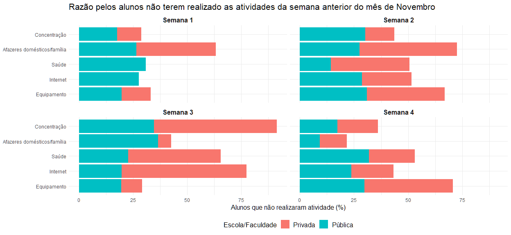<!-- -->

### Considerações:

  - A partir da visualização acima foi verificada uma grande variação de
    comportamento entre as quatro semanas;
  - Enquanto nas semanas 1 e 2 as atividades domésticas ou com
    familiares foi a maior razão para os alunos não fazerem suas
    atividades, na semana 4, essa razão apresentou-se como menor
    empecilho;
  - Na semana 1, somente os alunos da rede pública responderam que
    tiveram problemas relacionados à saúde ou à internet que os
    impediram de fazer as atividades;
  - Somente na semana 3 que os afazeres domésticos ou cuidar de
    familiares afetaram mais os alunos da rede pública do que privada;
  - Ao longo das semanas, não houve prevalência da rede pública ou
    privada sobre nenhum dos cinco motivos para a não realização de
    atividades.

## Razão pelos alunos não terem realizado as atividades das quatro semanas do mês de Novembro por faixa etária

``` r
pnad_freq_motivo_idade = pnad_escola %>%
  mutate(idade = case_when(
             A002 %in% 0:6 ~ "00 - 6",
             A002 %in% 7:10 ~ "07 - 10",
             A002 %in% 11:14 ~ "11 - 14",
             A002 %in% 15:24 ~ "15 - 24",
             A002 %in% 25:34 ~ "25 - 34", 
             A002 %in% 35:49 ~ "35 - 49", 
             A002 %in% 50:64 ~ "50 - 64", 
             A002 > 64 ~ "65+")) %>% 
  group_by(escola, razao_naohomework, idade) %>% 
  summarise(freq_motivo = survey_prop()) %>% 
  mutate(freq_motivo = freq_motivo * 100) %>%
  drop_na()

ggplot(pnad_freq_motivo_idade, aes(x = razao_naohomework, y = freq_motivo, fill = razao_naohomework)) +
  geom_bar(stat = "identity", position = "stack") +
  facet_grid(rows = vars(idade), cols = vars(escola)) + 
  labs(title = 'Razão pelos alunos não terem realizado as atividades das quatro semanas do mês de Novembro', y = 'Alunos que não realizaram atividade (%)', fill = 'Razão', x = NULL) +
  theme_bw() +
  theme(title = element_text(size = 13),
        strip.text.x = element_text(size=12, face="bold"),
        axis.text.x = element_blank(),
        strip.text.y = element_text(size=11, face="bold"),
        legend.text = element_text(size = 12),
        axis.title.x = element_text(size = 12),
        axis.title.y = element_text(size = 12))
```

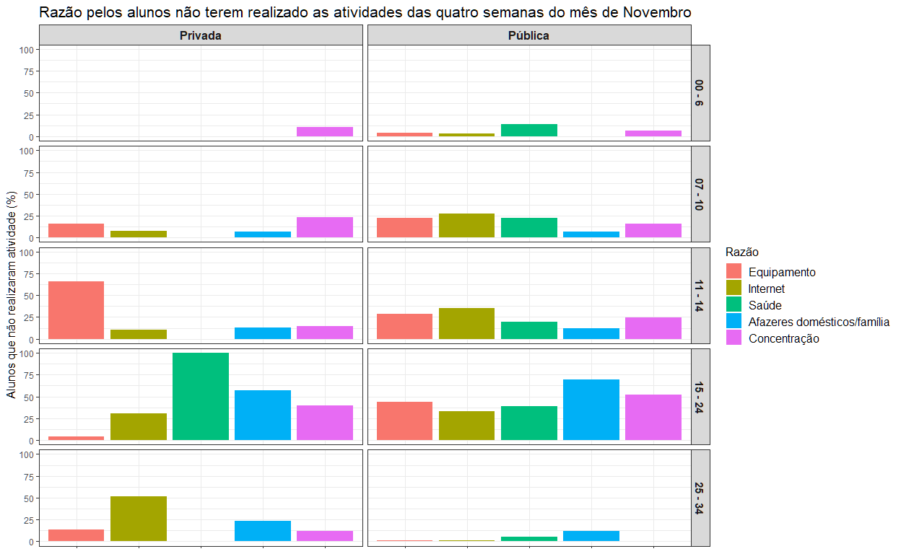<!-- -->

### Considerações

  - Na rede privada, problemas de saúde foram justificados como
    empecilho para a realização de tarefas somente na faixa etária de 15
    a 24 anos;
  - Na rede pública, pode-se destacar que as faixas entre 11 - 14 e 25 -
    34 tiveram, na mesma proporção, os afazeres domésticos ou cuidados
    familiares como razão para a não realização das atividades
    escolares/faculdade.

# PNAD - Sintomas, Exames e Resultados

## Distribuição entre os entrevistados diagnosticados com COVID por tipo de exame e por sintoma apresentado

**Observação:** A proporção de entrevistados positivados com covid foi
feito em relação ao número de pessoas que afirmaram terem feito algum
teste para saber se estava infectado(a) pelo coronavírus, ou seja,
quando a variável B008 foi definida com valor igual a 1.

### Febre

``` r
febre_teste_positivo = pnad_covid %>%
  filter(B0011 %in% c(1:3)) %>% 
  mutate(febre = case_when(
             B0011 == 1 ~ "Sim",
             B0011 == 2 ~ "Não",
             B0011 == 3 ~ "Não sabe")) %>% 
  group_by(febre) %>%
  summarise(total_positivo_swab = survey_total(B009B == 1, na.rm = TRUE),
            total_positivo_dedo = survey_total(B009D == 1, na.rm = TRUE),
            total_positivo_braco = survey_total(B009F == 1, na.rm = TRUE),
            total = survey_total(B008 == 1, na.rm = TRUE)) %>% 
  mutate(febre_positivo_swab = 100 * total_positivo_swab/total,
         febre_positivo_dedo = 100 * total_positivo_dedo/total,
         febre_positivo_braco = 100 * total_positivo_braco/total)

type.labels = c('Sangue através da veia do braço', 'Sangue através de furo no dedo',
                'Cotonete na boca e/ou nariz (SWAB)')
names(type.labels) = c('febre_positivo_braco', 'febre_positivo_dedo', 'febre_positivo_swab')

febre_teste_positivo %>% 
  select(febre, febre_positivo_swab, febre_positivo_dedo, febre_positivo_braco) %>% 
  pivot_longer(
    cols = !febre,
    names_to = 'variavel',
    values_to = 'metrica') %>% 
ggplot(aes(x = febre, y = metrica, fill = febre)) +
   geom_bar(stat = "identity") +
   facet_wrap(~variavel, labeller = labeller(variavel = type.labels)) +
   labs(title = 'Distribuição de pessoas que testaram positivo por sintoma de febre e tipo de teste',  y = '(%)', x = 'Na semana passada teve febre?') +
   theme_bw() +
   theme(title = element_text(size = 13),
        strip.text.x = element_text(size = 12, face ="bold"),
        legend.text = element_text(size = 12),
        axis.title.x = element_text(size = 12, face = 'bold'),
        legend.position = 'none')
```

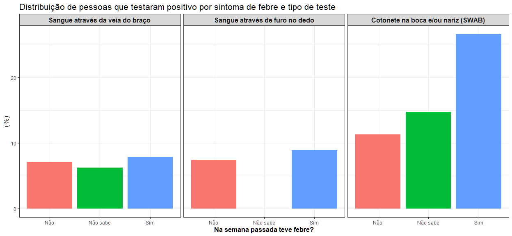<!-- -->

#### Considerações:

  - A proporção de casos positivos detectados por exames de sangue pelo
    braço ou dedo foram muito próximos entre as pessoas que disseram não
    terem tido febre e as que responderam que sim. No entanto, o
    contrário foi observado nos exames do tipo SWAB, em que a maioria
    que respondeu que sentiu febre teve resultado positivo para o COVID.

### Tosse

``` r
tosse_teste_positivo = pnad_covid %>%
  filter(B0012 %in% c(1:3)) %>% 
  mutate(tosse = case_when(
             B0012 == 1 ~ "Sim",
             B0012 == 2 ~ "Não",
             B0012 == 3 ~ "Não sabe")) %>% 
  group_by(tosse) %>%
  summarise(total_positivo_swab = survey_total(B009B == 1, na.rm = TRUE),
            total_positivo_dedo = survey_total(B009D == 1, na.rm = TRUE),
            total_positivo_braco = survey_total(B009F == 1, na.rm = TRUE),
            total = survey_total(B008 == 1, na.rm = TRUE)) %>% 
  mutate(tosse_positivo_swab = 100 * total_positivo_swab/total,
         tosse_positivo_dedo = 100 * total_positivo_dedo/total,
         tosse_positivo_braco = 100 * total_positivo_braco/total)

names(type.labels) = c('tosse_positivo_braco', 'tosse_positivo_dedo', 'tosse_positivo_swab')

tosse_teste_positivo %>% 
  select(tosse, tosse_positivo_swab, tosse_positivo_dedo, tosse_positivo_braco) %>% 
  pivot_longer(
    cols = !tosse,
    names_to = 'variavel',
    values_to = 'metrica') %>% 
ggplot(aes(x = tosse, y = metrica, fill = tosse)) +
   geom_bar(stat = "identity") +
   facet_wrap(~variavel, labeller = labeller(variavel = type.labels)) +
   labs(title = 'Distribuição de pessoas que testaram positivo por sintoma de tosse e tipo de teste',  y = '(%)', x = 'Na semana passada teve tosse?') +
   theme_bw() +
   theme(title = element_text(size = 13),
        strip.text.x = element_text(size = 12, face ="bold"),
        legend.text = element_text(size = 12),
        axis.title.x = element_text(size = 12, face = 'bold'),
        legend.position = 'none')
```

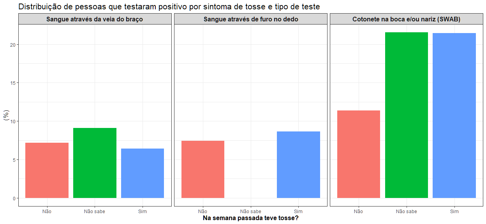<!-- -->

### Garganta

``` r
garganta_teste_positivo = pnad_covid %>%
  filter(B0013 %in% c(1:3)) %>% 
  mutate(garganta = case_when(
             B0013 == 1 ~ "Sim",
             B0013 == 2 ~ "Não",
             B0013 == 3 ~ "Não sabe")) %>% 
  group_by(garganta) %>%
  summarise(total_positivo_swab = survey_total(B009B == 1, na.rm = TRUE),
            total_positivo_dedo = survey_total(B009D == 1, na.rm = TRUE),
            total_positivo_braco = survey_total(B009F == 1, na.rm = TRUE),
            total = survey_total(B008 == 1, na.rm = TRUE)) %>% 
  mutate(garganta_positivo_swab = 100 * total_positivo_swab/total,
         garganta_positivo_dedo = 100 * total_positivo_dedo/total,
         garganta_positivo_braco = 100 * total_positivo_braco/total)

names(type.labels) = c('garganta_positivo_braco', 'garganta_positivo_dedo', 'garganta_positivo_swab')

garganta_teste_positivo %>% 
  select(garganta, garganta_positivo_swab, garganta_positivo_dedo, garganta_positivo_braco) %>% 
  pivot_longer(
    cols = !garganta,
    names_to = 'variavel',
    values_to = 'metrica') %>% 
ggplot(aes(x = garganta, y = metrica, fill = garganta)) +
   geom_bar(stat = "identity") +
   facet_wrap(~variavel, labeller = labeller(variavel = type.labels)) +
   labs(title = 'Distribuição de pessoas que testaram positivo por sintoma de dor de garganta e tipo de teste',  y = '(%)', x = 'Na semana passada teve dor de garganta?') +
   theme_bw() +
   theme(title = element_text(size = 13),
        strip.text.x = element_text(size = 12, face ="bold"),
        legend.text = element_text(size = 12),
        axis.title.x = element_text(size = 12, face = 'bold'),
        legend.position = 'none')
```

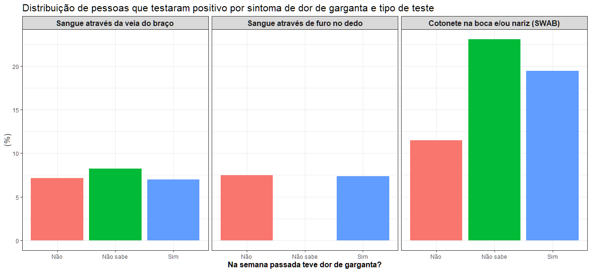<!-- -->

#### Considerações

  - Assim como verificado para os sintomas de febre e tosse, entre os
    três testes, o SWAB detectou mais casos como positivo, independente
    da resposta do entrevistado se teve, não teve ou não sabia se tinha
    tido dor de garganta na semana anterior da entrevista;
  - Os resultados dos testes foram semelhantes quando os sintomas
    questionados foram tosse e dor de garganta.

### Dificuldade de respirar

``` r
respirar_teste_positivo = pnad_covid %>%
  filter(B0014 %in% c(1:3)) %>% 
  mutate(respirar = case_when(
             B0014 == 1 ~ "Sim",
             B0014 == 2 ~ "Não",
             B0014 == 3 ~ "Não sabe")) %>% 
  group_by(respirar) %>%
  summarise(total_positivo_swab = survey_total(B009B == 1, na.rm = TRUE),
            total_positivo_dedo = survey_total(B009D == 1, na.rm = TRUE),
            total_positivo_braco = survey_total(B009F == 1, na.rm = TRUE),
            total = survey_total(B008 == 1, na.rm = TRUE)) %>% 
  mutate(respirar_positivo_swab = 100 * total_positivo_swab/total,
         respirar_positivo_dedo = 100 * total_positivo_dedo/total,
         respirar_positivo_braco = 100 * total_positivo_braco/total)

names(type.labels) = c('respirar_positivo_braco', 'respirar_positivo_dedo', 'respirar_positivo_swab')

respirar_teste_positivo %>% 
  select(respirar, respirar_positivo_swab, respirar_positivo_dedo, respirar_positivo_braco) %>% 
  pivot_longer(
    cols = !respirar,
    names_to = 'variavel',
    values_to = 'metrica') %>% 
ggplot(aes(x = respirar, y = metrica, fill = respirar)) +
   geom_bar(stat = "identity") +
   facet_wrap(~variavel, labeller = labeller(variavel = type.labels)) +
   labs(title = 'Distribuição de pessoas que testaram positivo por sintoma de dificuldade para respirar e tipo de teste',  y = '(%)', x = 'Na semana passada teve dificuldade para respirar?') +
   theme_bw() +
   theme(title = element_text(size = 13),
        strip.text.x = element_text(size = 12, face ="bold"),
        legend.text = element_text(size = 12),
        axis.title.x = element_text(size = 12, face = 'bold'),
        legend.position = 'none')
```

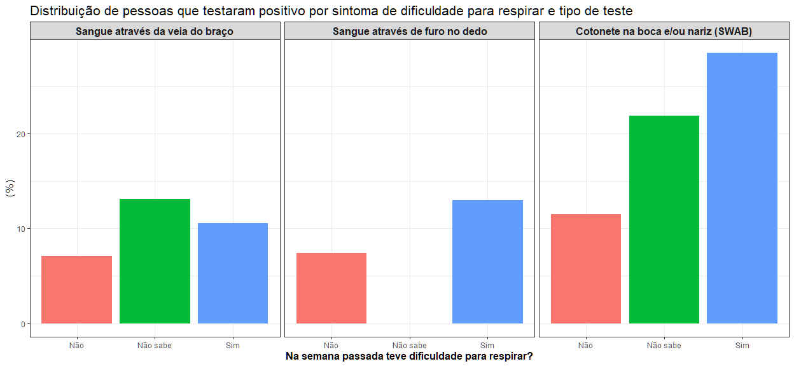<!-- -->

#### Considerações:

  - Deve-se destacar que a proximidade entre as proporções de resultados
    positivos dados pelos exames de sangue independente da percepção ou
    não de um sintoma (febre, tosse, dor de garganta e dificuldade de
    respirar) invalida a importância do sintoma como indício da doença
    quando se é realizado o exame de sangue, seja pelo dedo ou pelo
    braço.

### Perda do olfato ou paladar

``` r
olfato_paladar_teste_positivo = pnad_covid %>%
  filter(B00111 %in% c(1:3)) %>% 
  mutate(olfato_paladar = case_when(
             B00111 == 1 ~ "Sim",
             B00111 == 2 ~ "Não",
             B00111 == 3 ~ "Não sabe")) %>% 
  group_by(olfato_paladar) %>%
  summarise(total_positivo_swab = survey_total(B009B == 1, na.rm = TRUE),
            total_positivo_dedo = survey_total(B009D == 1, na.rm = TRUE),
            total_positivo_braco = survey_total(B009F == 1, na.rm = TRUE),
            total = survey_total(B008 == 1, na.rm = TRUE)) %>% 
  mutate(olfato_paladar_positivo_swab = 100 * total_positivo_swab/total,
         olfato_paladar_positivo_dedo = 100 * total_positivo_dedo/total,
         olfato_paladar_positivo_braco = 100 * total_positivo_braco/total)

names(type.labels) = c('olfato_paladar_positivo_braco', 'olfato_paladar_positivo_dedo', 'olfato_paladar_positivo_swab')

olfato_paladar_teste_positivo %>% 
  select(olfato_paladar, olfato_paladar_positivo_swab, olfato_paladar_positivo_dedo, olfato_paladar_positivo_braco) %>% 
  pivot_longer(
    cols = !olfato_paladar,
    names_to = 'variavel',
    values_to = 'metrica') %>% 
ggplot(aes(x = olfato_paladar, y = metrica, fill = olfato_paladar)) +
   geom_bar(stat = "identity") +
   facet_wrap(~variavel, labeller = labeller(variavel = type.labels)) +
   labs(title = 'Distribuição de pessoas que testaram positivo por sintoma de perda de olfato e/ou paladar e tipo de teste',  y = '(%)', x = 'Na semana passada teve perda de cheiro ou sabor?') +
   theme_bw() +
   theme(title = element_text(size = 13),
        strip.text.x = element_text(size = 12, face ="bold"),
        legend.text = element_text(size = 12),
        axis.title.x = element_text(size = 12, face = 'bold'),
        legend.position = 'none')
```

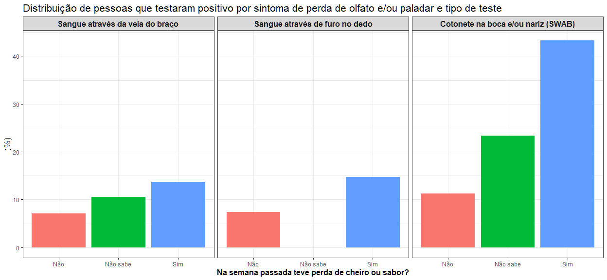<!-- -->

#### Considerações:

  - Somente para os sintomas de dificuldade de respirar e perda de
    olfato e/ou paladar que o exame SWAB apresentou uma taxa de casos
    positivos entre entrevistados que **não** tiveram o sintoma
    perguntado menor do que a taxa de positivos através do exame de
    sangue entre aqueles que afirmaram terem tido o sintoma questionado.
    Graficamente, a barra do **Sim** para os exames de sangue (dedo e
    braço) e sintomas de dificuldade para respirar e perda de olfato
    e/ou paladar foi maior do que a barra do **Não** para o teste SWAB.

  - Os resultados da pesquisa em relação ao sintoma de perda de olfato
    e/ou paladar para aqueles que fizeram o teste SWAB foi semelhante ao
    encontrado ao se perguntar sobre a dificuldade em respirar. No
    entanto, o sintoma de perda de olfato e/ou paladar foi aquele com
    maior acurácia ao indicar a presença do vírus (acima de 40%) quando
    detectado pelo exame de cotonete na boca e/ou nariz.

# PNAD - Exames

## Distribuição entre exames realizados pelos entrevistados

**Observação:** Para o total de exames realizados não foi utilizada a
variável B008 pois uma pessoa pode ter feito mais de um tipo de exame,
como pode ser visto na consulta pnad\_covid$variables %\>% filter(B008
== 1, B009A == 1 | B009C == 1 | B009E == 1) %\>% select(B008, B009A,
B009C, B009D).

``` r
#pnad_exames equivale a filtrar B009A, B009C e B009E == 1 de cada base

#pnad_covid %>%
#  filter(B008 == 1) %>% 
#  group_by(B009A) %>% 
#  summarise(total = survey_prop())

#pnad_covid %>%
#  filter(B008 == 1) %>% 
#  group_by(B009C) %>% 
#  summarise(total = survey_prop())

#pnad_covid %>%
#  filter(B008 == 1) %>% 
#  group_by(B009E) %>% 
#  summarise(total = survey_prop())

pnad_exames = pnad_covid %>% 
      summarise(teste_swab = survey_total(B009A == 1, na.rm = TRUE),
                teste_dedo = survey_total(B009C == 1, na.rm = TRUE),
                teste_braco = survey_total(B009E == 1, na.rm = TRUE)) %>% 
       mutate(total_testes =  sum(teste_swab, teste_dedo, teste_braco),
              swab_testes = 100 * teste_swab/total_testes,
              dedo_testes = 100 * teste_dedo/total_testes,
              braco_testes = 100 * teste_braco/total_testes) %>% 
      select(swab_testes, dedo_testes, braco_testes) %>% 
      pivot_longer(
          cols = everything(),
          names_to = 'exame',
          values_to = 'metrica'
        )

ggplot(pnad_exames, aes(x = '', y = metrica, fill = exame)) +
    geom_bar(stat = "identity") +
    geom_text(aes(label = paste0(round(metrica, 2), "%")), position = position_stack(vjust = 0.5), size = 5, color = 'grey31') + 
    coord_polar("y") +
    labs(title = 'Distribuição entre os tipos de exames realizados', fill = 'Tipo de Exame', x = NULL, y = NULL) +
    scale_fill_discrete(labels = c('Sangue através da veia do braço', 'Sangue através de furo no dedo', 'Cotonete na boca e/ou nariz (SWAB)')) +
    theme_classic() +
    theme(title = element_text(size = 13),
        legend.text = element_text(size = 12),
        axis.text = element_blank(),
        axis.line = element_blank(),
        axis.ticks = element_blank())
```

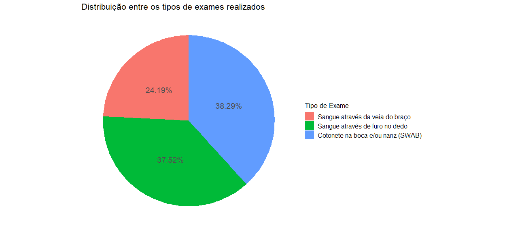<!-- -->

## Distribuição entre resultados concluídos (positivo, negativo ou inconclusivo) por tipo de exame

``` r
resultados_por_teste = pnad_covid %>% 
  filter(B009A == 1, B009B %in% c(1:3)) %>% 
  mutate(resultado = case_when(
             B009B == 1 ~ "Positivo",
             B009B== 2 ~ "Negativo",
             B009B == 3 ~ "Inconclusivo")) %>% 
  group_by(resultado) %>% 
  summarise(total_percent = survey_prop()) %>%
  mutate(total_percent = 100 * total_percent) %>% 
  add_column(exame = rep('swab', 3))

resultados_por_teste = rbind(resultados_por_teste, pnad_covid %>% 
  filter(B009C == 1, B009D %in% c(1:3)) %>% 
  mutate(resultado = case_when(
             B009D == 1 ~ "Positivo",
             B009D == 2 ~ "Negativo",
             B009D == 3 ~ "Inconclusivo")) %>% 
  group_by(resultado) %>% 
  summarise(total_percent = survey_prop()) %>%
  mutate(total_percent = 100 * total_percent) %>% 
  add_column(exame = rep('dedo', 3)))

resultados_por_teste = rbind(resultados_por_teste, pnad_covid %>% 
  filter(B009E == 1, B009F %in% c(1:3)) %>% 
  mutate(resultado = case_when(
             B009F == 1 ~ "Positivo",
             B009F == 2 ~ "Negativo",
             B009F == 3 ~ "Inconclusivo")) %>% 
  group_by(resultado) %>% 
  summarise(total_percent = survey_prop()) %>%
  mutate(total_percent = 100 * total_percent) %>% 
  add_column(exame = rep('braco', 3)))
  
names(type.labels) = c('braco', 'dedo', 'swab')
  
ggplot(resultados_por_teste, aes(x = '', y = total_percent, fill = resultado)) +
    geom_bar(stat = "identity") +
    geom_text(aes(label = paste0(round(total_percent, 2), "%")), position = position_stack(vjust = 0.5), size = 4, color = 'grey31') + 
    coord_polar("y") +
    facet_wrap(~exame, labeller = labeller(exame = type.labels)) +
    labs(title = 'Distribuição entre os resultados por tipo de exame', fill = 'Resultado', x = NULL, y = NULL) +
    theme_bw() +
    theme(title = element_text(size = 13),
        legend.text = element_text(size = 12),
        strip.text.x = element_text(size = 12, face ="bold"),
        axis.text = element_blank(),
        axis.line = element_blank(),
        axis.ticks = element_blank())
```

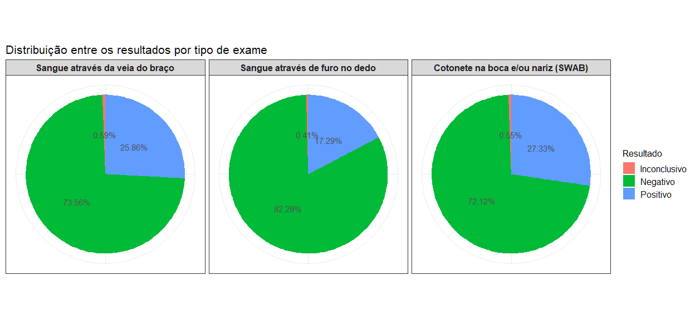<!-- -->

## Distribuição entre os exames por região do país

``` r
pnad_regiao = pnad_covid %>% 
      mutate(regiao = case_when(
                         UF %in% c(11:17) ~ "Norte",
                         UF %in% c(21:29) ~ "Nordeste",
                         UF %in% c(31:35) ~ "Suldeste",
                         UF %in% c(41:43) ~ "Sul",
                         UF %in% c(50:53) ~ "Centro-Oeste")) %>% 
      group_by(regiao) %>% 
      summarise(teste_swab = survey_total(B009A == 1, na.rm = TRUE),
                teste_dedo = survey_total(B009C == 1, na.rm = TRUE),
                teste_braco = survey_total(B009E == 1, na.rm = TRUE))

total_testagem = pnad_regiao %>% 
      select(teste_swab, teste_dedo, teste_braco) %>% rowSums()

pnad_regiao = pnad_regiao %>% 
       mutate(total_testes = total_testagem,
              swab_testes = 100 * teste_swab/total_testes,
              dedo_testes = 100 * teste_dedo/total_testes,
              braco_testes = 100 * teste_braco/total_testes)

pnad_regiao %>% 
      select(regiao, swab_testes, dedo_testes, braco_testes) %>% 
      pivot_longer(
          cols = !regiao,
          names_to = 'exame',
          values_to = 'metrica'
        ) %>% 

ggplot(aes(x = '', y = metrica, fill = exame)) +
    geom_bar(stat = "identity") +
    geom_text(aes(label = paste0(round(metrica, 2), "%")), position = position_stack(vjust = 0.5), size = 5, color = 'grey31') + 
    coord_polar("y") +
    facet_wrap(~regiao, nrow = 2) +
    labs(title = 'Distribuição entre os tipos de exames por região', fill = 'Tipo de Exame', x = NULL, y = NULL) +
    scale_fill_discrete(labels = c('Sangue através da veia do braço', 'Sangue através de furo no dedo', 'Cotonete na boca e/ou\n nariz (SWAB)')) +
    theme_bw() +
    theme(title = element_text(size = 13),
        legend.text = element_text(size = 12),
        axis.text = element_blank(),
        axis.line = element_blank(),
        axis.ticks = element_blank(),
        strip.text.x = element_text(size = 12, face ="bold"))
```

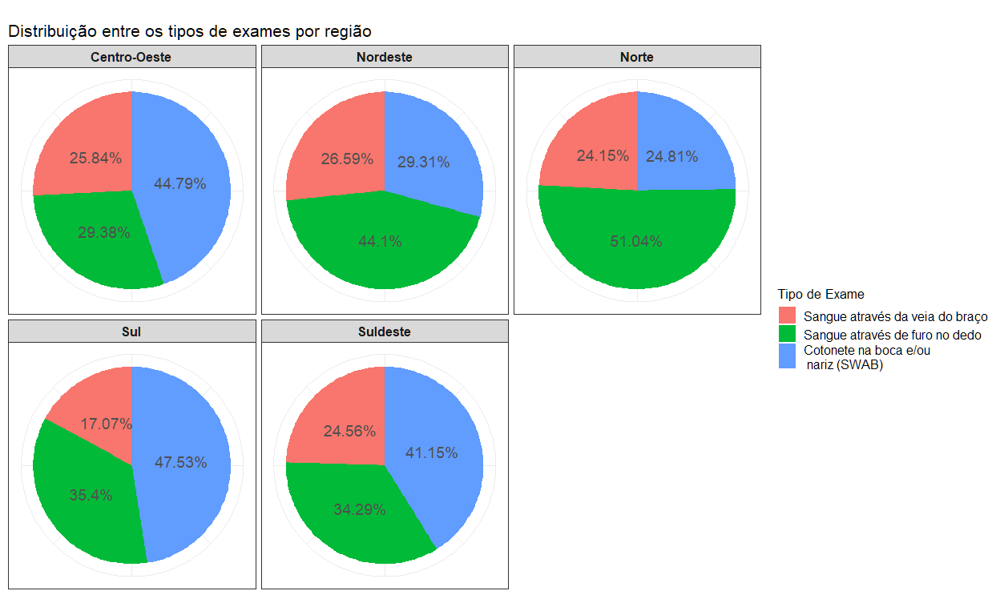<!-- -->

### Considerações:

  - As regiões Norte e Nordeste apresentaram maior proporção de exames
    de sangue através do dedo ao contrário da proporção nacional de
    exames, onde a coleta com cotonete pela boca e/ou nariz foi maior.

## Distribuição entre os exames por faixa salarial

``` r
pnad_salario = pnad_covid %>% 
      mutate(salario = factor(case_when(
            C01012 <= 1044 ~ "Menos de um salário mínimo",
            C01012 %in% c(1045:2090) ~ "Entre 1 e 2",
            C01012 %in% c(2091:3135) ~ "Entre 2 e 3",
            C01012 %in% c(3136:4180) ~ "Entre 3 e 4",
            C01012 %in% c(4181:5225) ~ "Entre 4 e 5",
            C01012 >= 5226 ~ "Mais de 5"),
              levels = c("Menos de um salário mínimo",
                         "Entre 1 e 2",
                         "Entre 2 e 3",
                         "Entre 3 e 4",
                         "Entre 4 e 5",
                         "Mais de 5"))) %>% 
      group_by(salario) %>% 
      summarise(teste_swab = survey_total(B009A == 1, na.rm = TRUE),
                teste_dedo = survey_total(B009C == 1, na.rm = TRUE),
                teste_braco = survey_total(B009E == 1, na.rm = TRUE)) %>% 
      drop_na()
    
total_testagem = pnad_salario %>% 
      select(teste_swab, teste_dedo, teste_braco) %>% rowSums()

pnad_salario = pnad_salario %>% 
      mutate(total_testes = total_testagem,
              swab_testes = 100 * teste_swab/total_testes,
              dedo_testes = 100 * teste_dedo/total_testes,
              braco_testes = 100 * teste_braco/total_testes)

pnad_salario %>% 
      select(salario, swab_testes, dedo_testes, braco_testes) %>% 
      pivot_longer(
          cols = !salario,
          names_to = 'exame',
          values_to = 'metrica'
        ) %>% 

ggplot(aes(x = '', y = metrica, fill = exame)) +
    geom_bar(stat = "identity") +
    geom_text(aes(label = paste0(round(metrica, 2), "%")), position = position_stack(vjust = 0.5), size = 4.5, color = 'grey31') + 
    coord_polar("y") +
    facet_wrap(~salario, nrow = 2) +
    labs(title = 'Distribuição entre os tipos de exames por faixa salarial', fill = 'Tipo de Exame', x = NULL, y = NULL) +
    scale_fill_discrete(labels = c('Sangue através da veia do braço', 'Sangue através de furo no dedo', 'Cotonete na boca e/ou\n nariz (SWAB)')) +
    theme_bw() +
    theme(title = element_text(size = 13),
        legend.text = element_text(size = 12),
        axis.text = element_blank(),
        axis.line = element_blank(),
        axis.ticks = element_blank(),
        strip.text.x = element_text(size = 12, face ="bold"))
```

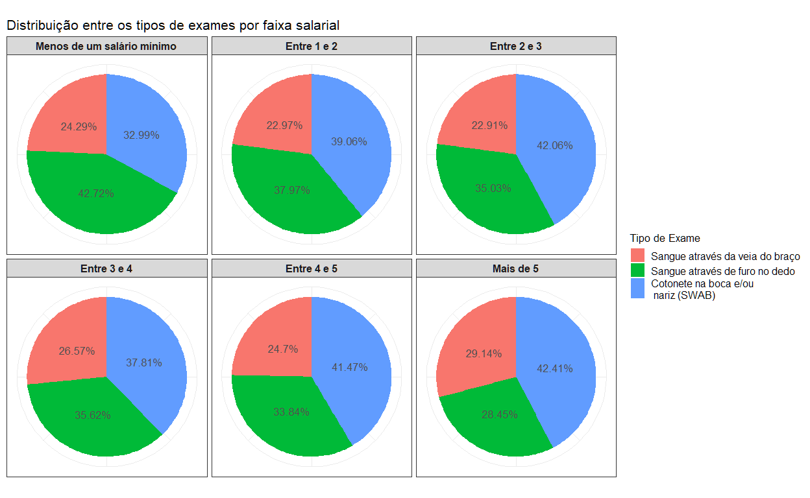<!-- -->

### Considerações:

  - O mesmo tipo de exame mais frequente nas regiões Norte e Nordeste
    foi também o majoritário entre a população com renda menor do que um
    salário mínimo;
  - Já entre a população com mais de 5 salários mínimos, o exame de
    sangue através do braço superou a proporção de exames através de
    furo no dedo.

## Distribuição de exames por faixa etária

``` r
pnad_idade = pnad_covid %>% 
      mutate(idade = case_when(
               A002 %in% 15:24 ~ "15-24",
               A002 %in% 25:34 ~ "25-34", 
               A002 %in% 35:49 ~ "35-49", 
               A002 %in% 50:64 ~ "50-64", 
               A002 > 64 ~ "65+")) %>% 
      group_by(idade) %>% 
      summarise(teste_swab = survey_total(B009A == 1, na.rm = TRUE),
                teste_dedo = survey_total(B009C == 1, na.rm = TRUE),
                teste_braco = survey_total(B009E == 1, na.rm = TRUE)) %>% 
      drop_na()
    
total_testagem = pnad_idade %>% 
      select(teste_swab, teste_dedo, teste_braco) %>% rowSums()

pnad_idade = pnad_idade %>% 
      mutate(total_testes = total_testagem,
              swab_testes = 100 * teste_swab/total_testes,
              dedo_testes = 100 * teste_dedo/total_testes,
              braco_testes = 100 * teste_braco/total_testes)

pnad_idade %>% 
      select(idade, swab_testes, dedo_testes, braco_testes) %>% 
      pivot_longer(
          cols = !idade,
          names_to = 'exame',
          values_to = 'metrica'
        ) %>% 

ggplot(aes(x = '', y = metrica, fill = exame)) +
    geom_bar(stat = "identity") +
    geom_text(aes(label = paste0(round(metrica, 2), "%")), position = position_stack(vjust = 0.5), size = 4.5, color = 'grey31') + 
    coord_polar("y") +
    facet_wrap(~idade, nrow = 2) +
    labs(title = 'Distribuição entre os tipos de exames por faixa etária', fill = 'Tipo de Exame', x = NULL, y = NULL) +
    scale_fill_discrete(labels = c('Sangue através da veia do braço', 'Sangue através de furo no dedo', 'Cotonete na boca e/ou\n nariz (SWAB)')) +
    theme_bw() +
    theme(title = element_text(size = 13),
        legend.text = element_text(size = 12),
        axis.text = element_blank(),
        axis.line = element_blank(),
        axis.ticks = element_blank(),
        strip.text.x = element_text(size = 12, face ="bold"))
```

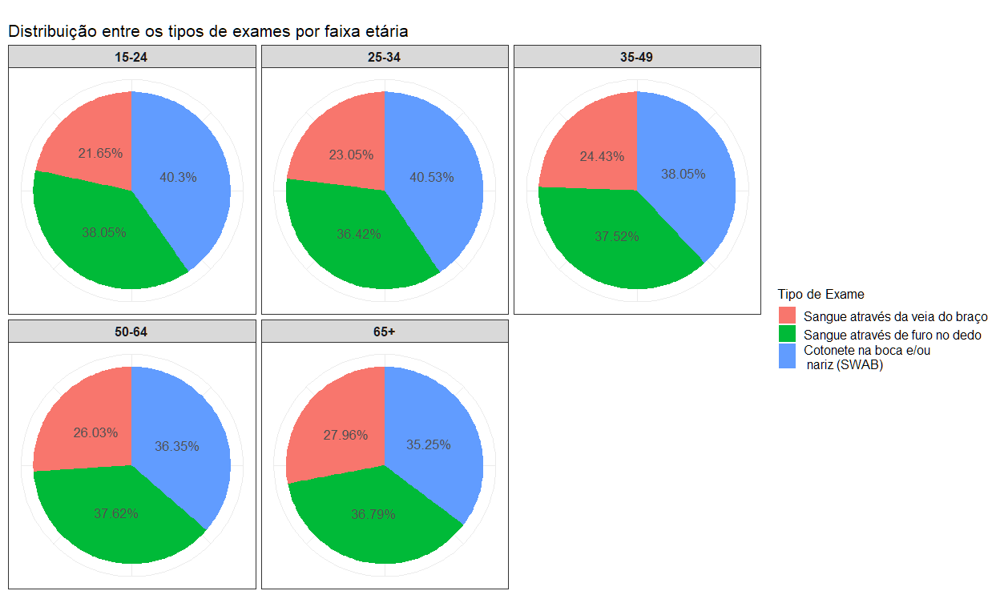<!-- -->

### Considerações:

  - Os entrevistados a partir de 50 anos fizeram com maior frequência o
    exame de sangue através do dedo enquanto as demais faixas etárias
    seguem a proporção nacional com prevalência do teste SWAB.
